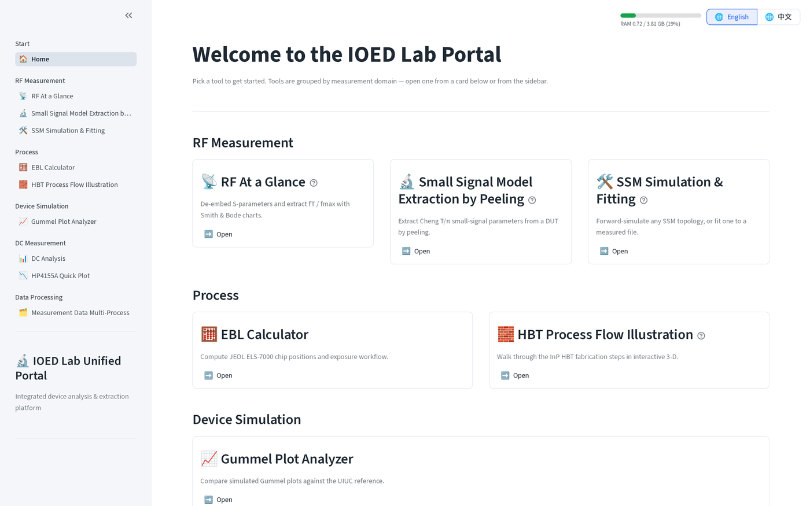
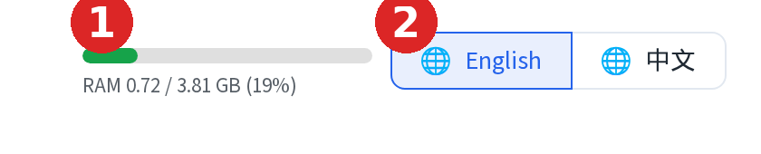

# The portal

How to open the portal, log in, and switch language.

## Home screen

The home screen lists every tool as a card, grouped by measurement domain.

One line per group:

- **RF Measurement**: de-embed S-parameters, extract small-signal models, forward-simulate or fit them.
- **Process**: the e-beam lithography calculator and the HBT process-flow illustration.
- **Device Simulation**: compare simulated Gummel plots against a reference.
- **DC Measurement**: B1500A and HP4155A curve viewers.
- **Data Processing**: batch-convert measurement files for the DC tools.

Click **Open** on a card, or use the sidebar, to go to a tool.

## The side panel

The sidebar is how you move between tools. Collapse it to get the main
content more room, or reopen it from the hamburger control that replaces it.

1. Click **«** at the top of the sidebar to collapse it.

    

2. Click the **»** control that appears top-left once the sidebar is
   collapsed, to open it again.

    

## Language toggle

Click **English** / **中文** top-right to switch the whole portal. Sidebar labels, page titles and body text all follow.

    

## RAM badge

The bar left of the language toggle (marker 1 above) shows server-side RAM
usage: `used / limit GB`, refreshed every 10 seconds. It turns amber past 60%
and red past 85%.

Uploads are capped at 350 MB per file; larger files are refused with a
message. The EBL calculator also checks the RAM that is actually free when it
loads a file, so the same file can be accepted when the app is idle and
refused when it is busy.

!!! tip
    Running the app locally via `LAUNCH_Tool.py` raises the upload cap to a
    share of your workstation's RAM instead of the fixed 350 MB.

## Password gate

A deployed portal asks for a password before showing anything else; a local
launch via `LAUNCH_Tool.py` skips this screen entirely.
