# B1500A Excel viewer

Plots B1500A curves and extracts DC parameters from them. Sidebar
**DC Measurement → DC Analysis**, page selector at the top set to
**B1500A Excel Viewer** (the other option is [TLM Analysis](tlm.md)).

The viewer only takes `.xlsx`. The fastest way to get files in is the
hand-off from [Measurement Data Multi-Process](multi-process.md);
uploading your own `.xlsx` works the same way.

## Arriving here

After a hand-off, the page opens with a banner and the received files
   already in the pickers below. Pick which uploaded/received file to view,
   then the sheet inside it if it has more than one, then the curve type.

   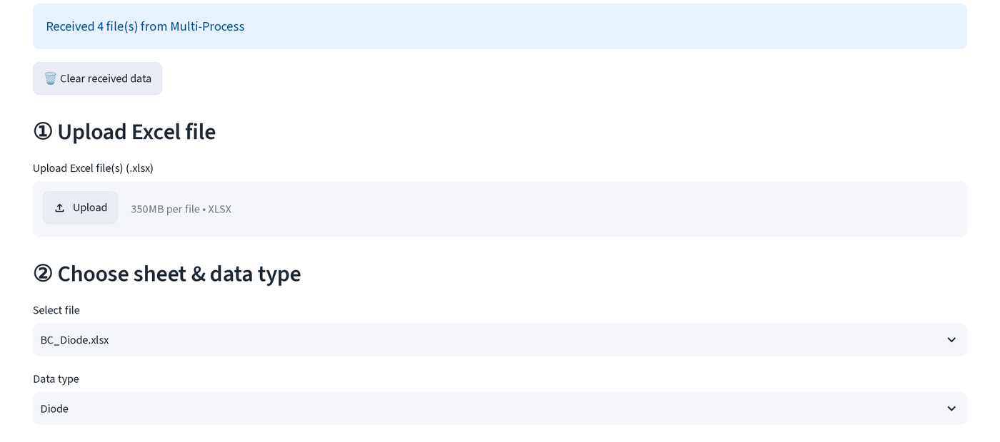

Data type defaults from the filename (`Diode` for BE/BC, `Gummel`,
`Family`) but is a plain dropdown, change it if the guess is wrong.

## Curve types

### BC / BE diode

Plots `|I|` on a log axis against the swept voltage. The **η window**, two
numbers or a drag-select on the plot, sets the voltage range the ideality
fit uses.

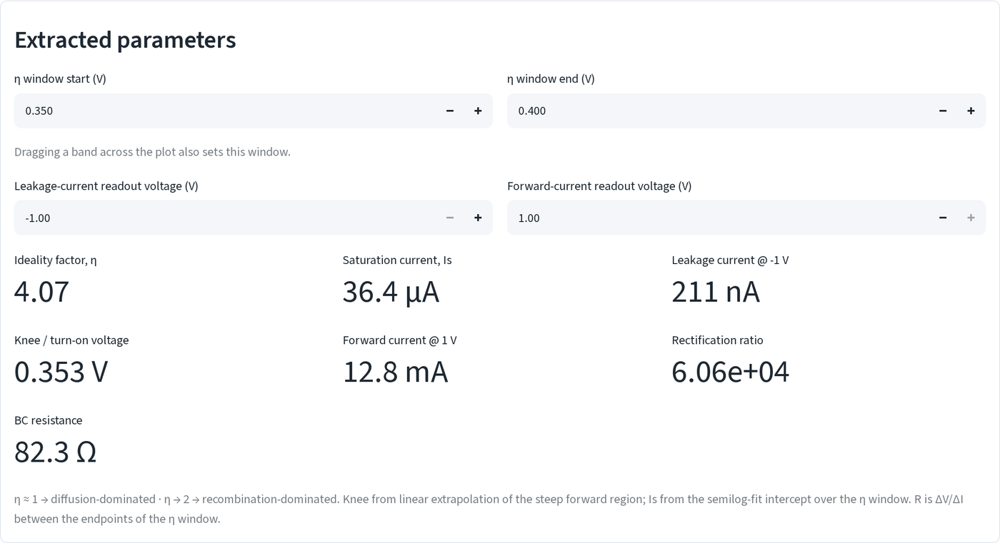
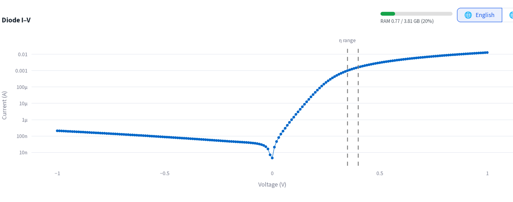

- **Ideality factor, η**: semilog fit of `I` vs `V` inside the η window.
  η ≈ 1 is diffusion-dominated, η → 2 is recombination-dominated.
- **Saturation current, Is**: the y-intercept of that same fit.
- **Knee / turn-on voltage**: linear extrapolation of the steep forward
  region back to `I = 0`.
- **BC/BE resistance**: chord resistance ΔV/ΔI between the two ends of the
  η window (labeled by whichever of "bc"/"be" appears in the file name).
- **Forward current @ V** / **Leakage current @ V**: the two readout
  voltages are separate number inputs above the metrics; move them to read
  the curve anywhere.
- **Rectification ratio**: forward current at `+|V|` divided by reverse
  current at `-|V|`, using the smaller of the sweep's two endpoint
  magnitudes.

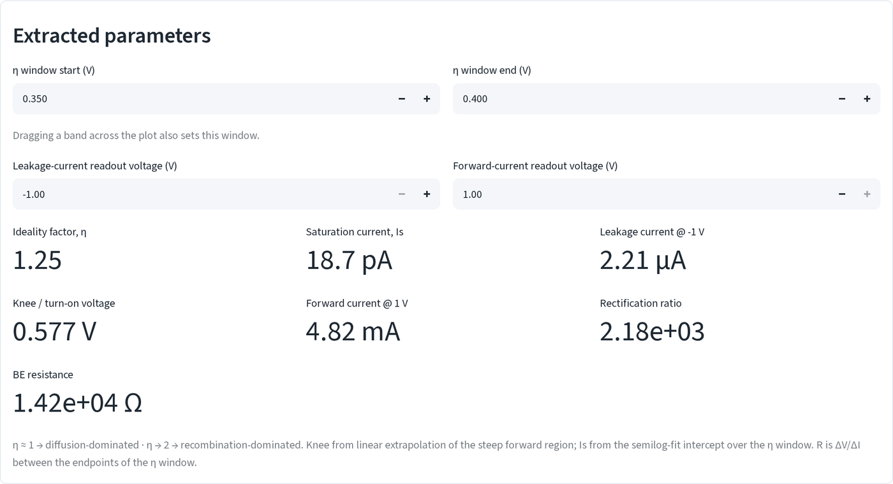
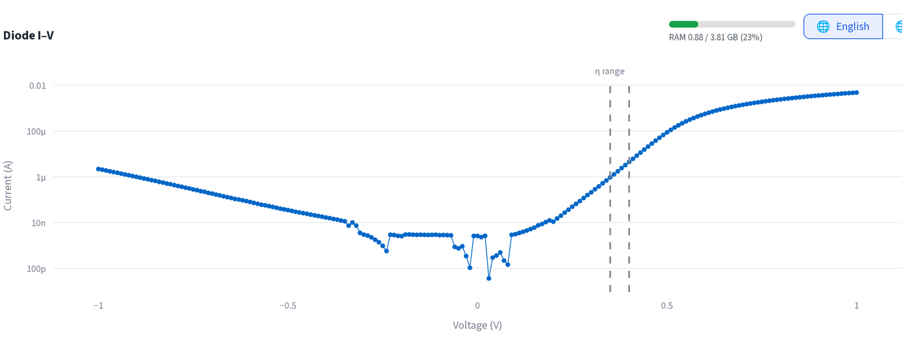

### Gummel

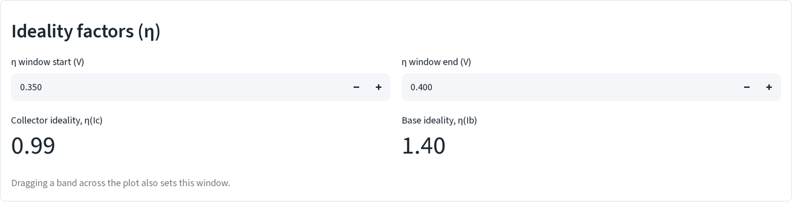
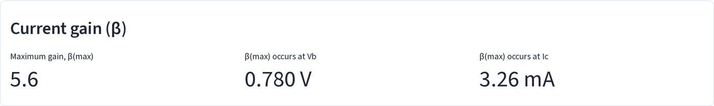
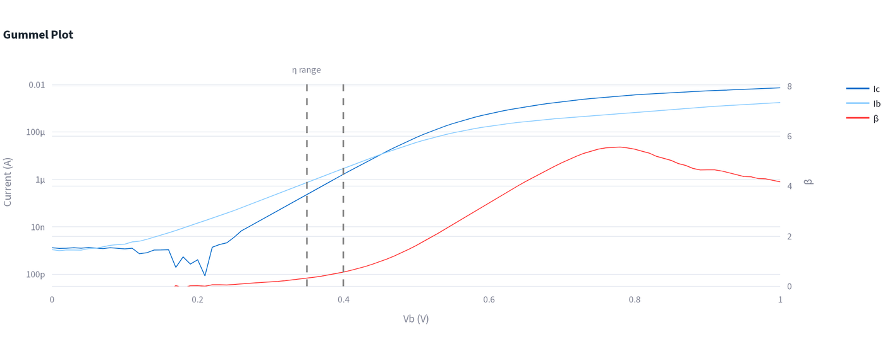

Plots Ic and Ib on a shared log axis against Vb, plus β = Ic/Ib on a
second linear axis. Same η-window control as the diode pages, applied to
both Ic and Ib independently:

- **Collector / base ideality, η(Ic) / η(Ib)**: same semilog-fit method as
  the diode page, one fit each for Ic and Ib.
- **Maximum gain, β(max)**: peak of Ic/Ib over the sweep, plus the Vb and
  Ic where it occurs.

### Ic-Vc family

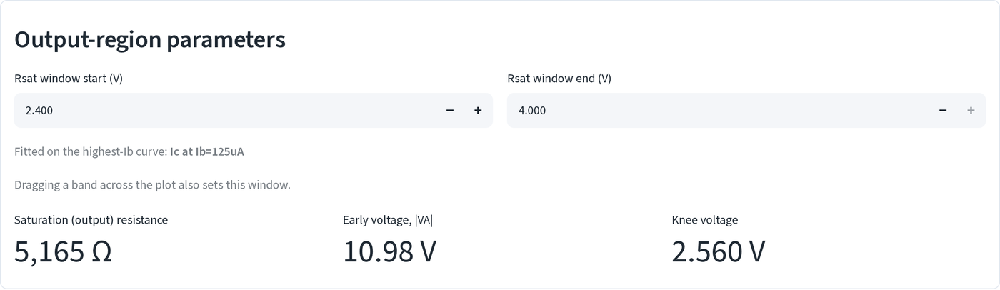
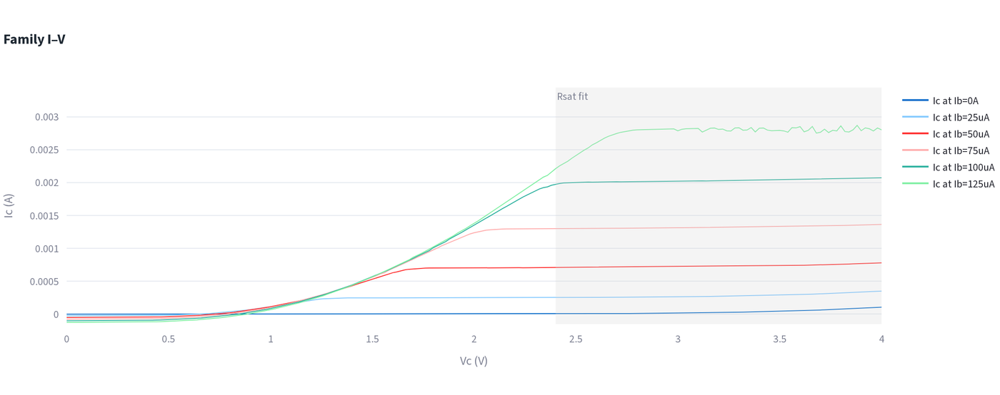

One Ic-vs-Vc curve per Ib step. Controls and readouts:

- **Rsat window**: a Vc range (drag-select or number inputs) fit on the
  *highest-Ib* curve only.
- **Saturation (output) resistance**: `1/slope` of a linear fit of Ic vs
  Vc inside that window.
- **Early voltage, |VA|**: magnitude of that same fit's x-intercept.
- **Knee voltage**: Vc where Ic first reaches 90% of its saturation value
  (mean Ic over the top 20% of the sweep).

Hovering a curve shows its own DC gain β and offset voltage (Ic
zero-crossing) in a tooltip; the two sections below summarize both across
every curve on the plot:

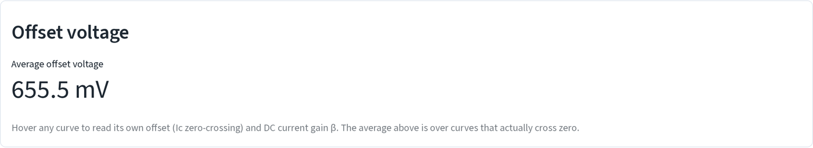
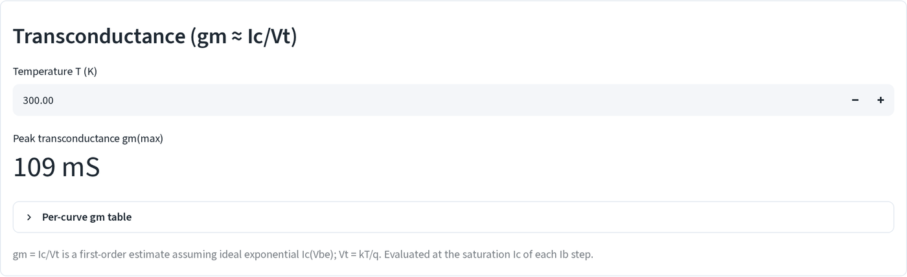

- **Average offset voltage**: mean Ic zero-crossing over curves that
  actually cross zero.
- **Peak transconductance, gm(max)**: `gm = Ic/Vt` (Vt = kT/q at the
  temperature you set) evaluated at each curve's saturation Ic; expand
  **Per-curve gm table** for the per-step numbers.

## Other controls

- **Drag-select on any plot** sets the same window the number inputs
  above it do (η window, Rsat window); the two are linked either
  direction.
- Uploads persist across a page-switch to TLM Analysis and back; use the
  **Clear** button next to the "previously uploaded" caption to drop them,
  or **🗑️ Clear received data** to drop a hand-off.
