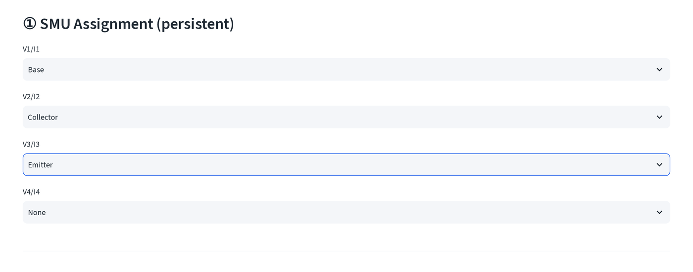
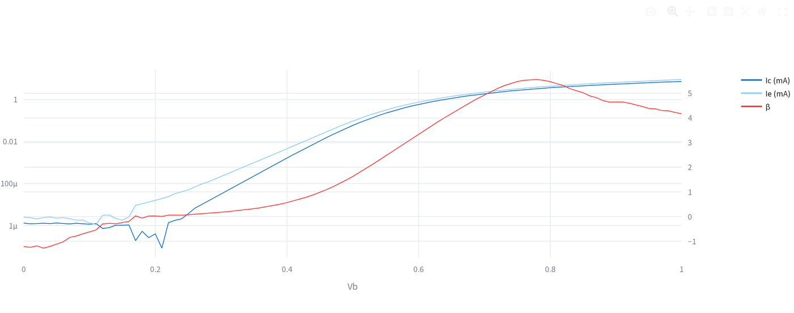
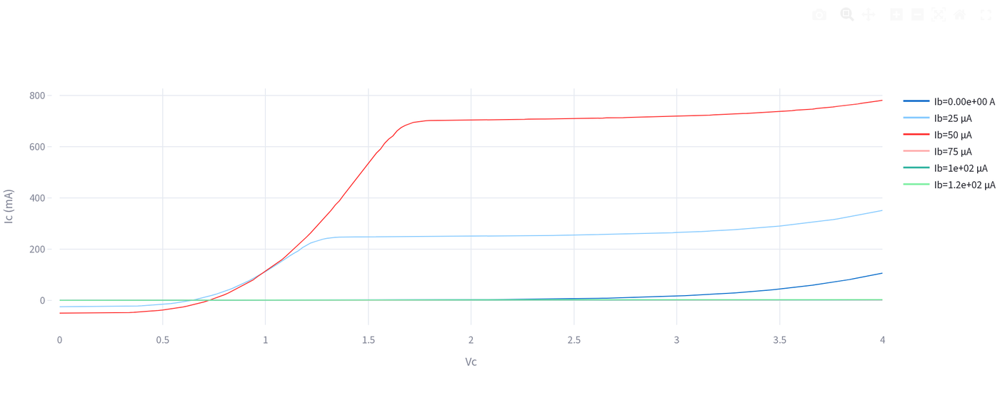

# HP4155A 快速繪圖

直接由 HP/Agilent 4155A 文字匯出檔畫出互動式 SMU 圖，不需先轉檔。側邊欄
**直流量測 (DC Measurement) → HP4155A 快速繪圖 (HP4155A Quick Plot)**。

`guide/_data/dc/hp4155a/` 裡的兩個範例檔不是真正的 4155A 匯出檔，而是本指南
精選的 Gummel 與 Family B1500A CSV，經數值轉換為 4155A 欄位格式（往返驗證
見該資料夾的 `VERIFY.md`）。用它們可以看到整個操作流程，其底層的 I、V 資料
與 [B1500A 檢視器](b1500a.md)頁面上記載的是同一批元件。

## 檔案格式

從儀器以 **List Display → Save ASCII** 匯出，通道名稱維持儀器預設值。工具
預期的格式是：

- 純文字表格，以 tab 或逗號分隔，**先是標頭列，前面沒有其他內容**，第 0
  列會直接當成欄位名稱讀入。
- 欄位名稱須恰好為 `V1`、`I1`、`V2`、`I2`、`V3`、`I3`、`V4`、`I4`（可以只
  用其中一部分，不需要接滿全部四組 SMU）。
- 數字採用儀器的科學記號格式，例如 `1.23456E-02`。

## 步驟

1. **① SMU 指定（永久保存）(SMU Assignment)**：為四組 V/I 欄位配對分別
   指定它驅動的元件端點：Collector、Base、Emitter、PD 或 None。這個設定會
   保留到之後的檔案與頁面重新整理。

   

2. **② 資料檔案 (Data File)**：上傳匯出檔。沒有檔案類型限制，任何能被解析
   成分隔表格的檔案都可以。

   

3. **③ 繪圖設定 (Plot Settings) → 資料類型 (Data type)**：Diode、Gummel、
   Family 或 Family L-Ic-Vc，接著按 **📊 顯示 (Show)**。Family L-Ic-Vc
   需要指定 PD 角色（它會透過響應率欄位把該通道的電流轉成光功率）；一般
   Family 只需要 Collector 與 Base。

## 讀取結果

Gummel 圖在共用的對數軸上畫出 Ic 與 Ib，並在線性右軸畫 β，與 B1500A
檢視器的 Gummel 圖版面相同：

Family 圖每個 Ib 步階畫一條 Ic 對 Vc 曲線（本範例的 SMU 角色只有 Collector
與 Base，沒有接 PD，因此匯出檔用的是 **Family Ic-Vc**，不是 **Family
L-Ic-Vc**）：

## 匯出

每張圖下方都有一個 **📥 下載 Excel (Download Excel)** 按鈕與一個 **複製
(copy)** 按鈕並排。按這個按鈕即可把資料複製到剪貼簿，方便貼到 Origin。

## 其他控制項

- **手動座標軸範圍 (Manual axis limits)**：勾選後會出現 X 最小值／最大值與
  Y 最小值／最大值的數字輸入欄；不勾選則自動縮放。
- **顯示格線 (Show grid)** / **顯示次要格線 (Show minor grid)**，格線開關，
  主格線預設開啟，次要格線預設關閉。
- 電流曲線會依資料落在的範圍自動選擇單位（A/mA/µA），座標軸標籤會同步更新。
- 步驟一的 SMU 角色指定與[量測資料批次處理](multi-process.md#其他批次模式)
  裡的批次版 **HP4155A 資料處理工具 (HP4155A Data Processing Tool)** 共用，
  同樣的四個下拉選單、同樣的角色名稱，只是不同頁面。
