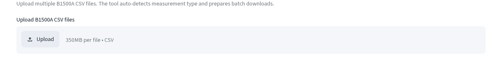
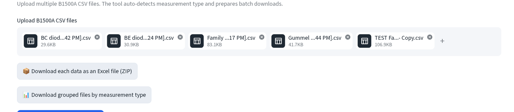

# 量測資料批次處理

批次轉換原始儀器匯出檔為 DC 頁面可讀取的活頁簿，並可直接將結果交給 DC 分析，
不必重新上傳。側邊欄 **資料處理 (Data Processing) → 量測資料批次處理
(Measurement Data Multi-Process)**。

頁面預設開啟 **B1500A 智慧批次工具 (B1500A Smart Batch Tool)**，頂端的側邊欄
選項可切換到另外四種模式（見下方[其他批次模式](#其他批次模式)）。

## 上傳

將 B1500A CSV 匯出檔拖放到上傳區。可一次上傳多個檔案，每個檔案上限 350
   MB，僅接受 CSV。

   

   工具會讀取每個檔名開頭的兩個字母來判斷量測類型：`BC` → BC 二極體、`BE` →
   BE 二極體、`Fa` → Ic-Vc 族群、`Gu` → Gummel、`Tl` → TLM。其他一律歸入
   **Other** 並略過，請依此規則命名匯出檔，或在上傳前重新命名。

## 結果

每個能辨識的檔案都會立即轉換，不需按任何按鈕。畫面會出現兩個 ZIP
   下載：一個是每個輸入檔對應一份活頁簿，另一個是每種量測類型各一份活頁簿
   （同類型的所有檔案各自成為一張工作表，收在同一個 `.xlsx` 裡）。

   

   依類型分組的檔名：`IcVc_Family.xlsx`、`BE_Diode.xlsx`、`BC_Diode.xlsx`、
   `Gummel.xlsx`、`TLM.xlsx`、`Other.xlsx`。

## 交給 DC 分析

點選 **🔬 在 DC 分析中檢視 (Analyze Data in DC Analysis)**，將
   Family/Gummel/BE/BC 的活頁簿直接送到 B1500A 檢視器，不需下載，也不需
   重新上傳。TLM 與 Other 檔案不會被送出，按鈕下方的說明文字會標示略過了
   幾個檔案。

   

   B1500A 檢視器開啟後會顯示「已從批次處理接收 N 個檔案」的提示，且收到的
   活頁簿已經列在檔案選擇器中，見 [B1500A Excel 檢視器](b1500a.md)。

## 其他批次模式

頁面頂端的側邊欄選項可切換到共用此頁面的另外四種工具：

- **B1500A 欄位選取與批次 (B1500A Column Selection & Batch)**：上傳一個
  範例 CSV，挑選（或自訂）欄位範本並儲存，接著將這個範本套用到一整批其他
  CSV。當你的欄位不符合五種內建預設時使用。
- **TLM 電阻平均 (TLM Resistance Avg)**：上傳 `TLM batch output.xlsx`
  （即上方分組下載的產物，前提是批次中包含 `Tl…` 前綴的檔案），指定電阻欄位
  名稱（預設為 `Rsa`），即可取得各工作表的平均值，以表格呈現並可下載。
- **E5270B CITI 檔案工具 (E5270B citi File Tool)**：接受 `.citi`、`.txt`
  與純 `.csv` 的 CITI 格式匯出檔，並和 CSV 工具一樣把結果歸類成
  BE/BC/Gummel/Family。
- **HP4155A 資料處理工具 (HP4155A Data Processing Tool)**：[HP4155A 快速繪圖
  (HP4155A Quick Plot)](hp4155a.md) 中 SMU 角色指定的批次版本：一次指定好
  V/I 欄位配對對應的 Collector/Base/Emitter/PD，即可一次把整個資料夾的
  HP4155A 原始匯出檔轉成 Family/Gummel/Diode 活頁簿。
