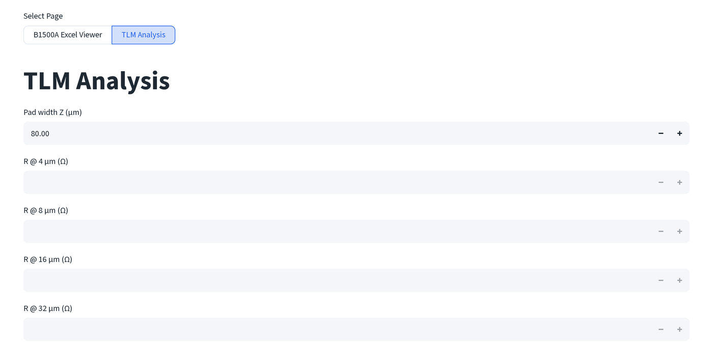

# TLM 分析

由四個固定接觸間距量到的電阻，做傳輸線法 (Transfer Length Method) 擬合，
求出接觸電阻與片電阻。與 B1500A 檢視器同一個頁面，頂端頁面選擇器設為
**TLM 分析 (TLM Analysis)**。

**本 repo 的範例資料中沒有附 TLM 掃描。** `guide/_data/dc/` 裡精選的四個檔案，
以及原始的 `dc_data/` 匯出資料夾，都沒有 `Tl…` 前綴的量測資料，因此本頁的每
張截圖都是工具的空白預設狀態，不是真實元件的資料。下方的數字是程式碼裡的
公式，不是實測範例。

## 這個工具需要的資料

與 B1500A 檢視器不同，這個頁籤不接受檔案上傳。手動輸入一個焊墊寬度與最多
四個電阻讀值：

1. **焊墊寬度 Z (µm) (Pad width Z (µm))**，一個數字，預設為 80。
2. **R @ 4 / 8 / 16 / 32 µm (Ω)**，在四個固定接觸間距各自量到的電阻。四個
   欄位中任何一個留空，就會把它排除在擬合之外。

   

如果你先透過[量測資料批次處理](multi-process.md#其他批次模式)批次轉換
過 TLM 掃描，其 **TLM 電阻平均 (TLM Resistance Avg)** 模式會讀取
`TLM batch output.xlsx`，並計算每個工作表電阻欄位的平均值，這些各間距的
平均值就是你要輸入到這裡四個欄位的數字。

## 擬合

只要四個 R 值中填入兩個以上，頁面就會用一條直線
R = slope·spacing + intercept 進行擬合，並回報：

- **接觸電阻 Rc (Contact resistance, Rc)**：擬合截距的一半。
- **片電阻 Rsh (Sheet resistance, Rsh)**：斜率 × 焊墊寬度 Z。
- **傳輸長度 LT (Transfer length, LT)**：Rc / slope。
- **比接觸電阻率 ρc (Specific contact resistivity, ρc)**：Rc · LT · Z
  （單位換算為 Ω·cm²）。
- **擬合優度 R² (Goodness, R²)**：四個點對擬合線的相關係數平方。

擬合完成後，量測點與擬合直線（間距 0, 40 µm）的圖會出現在指標下方。
