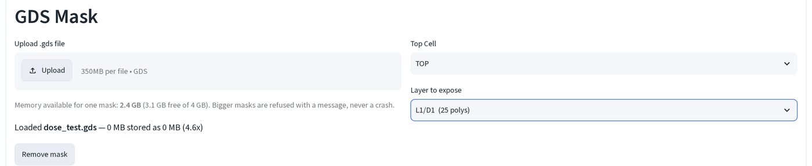
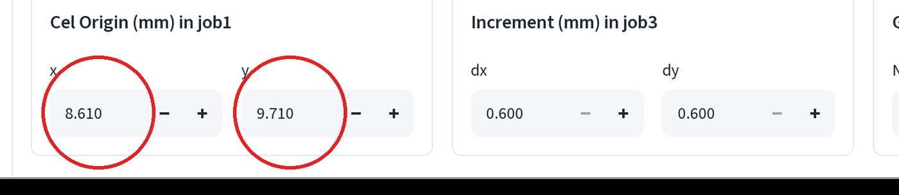
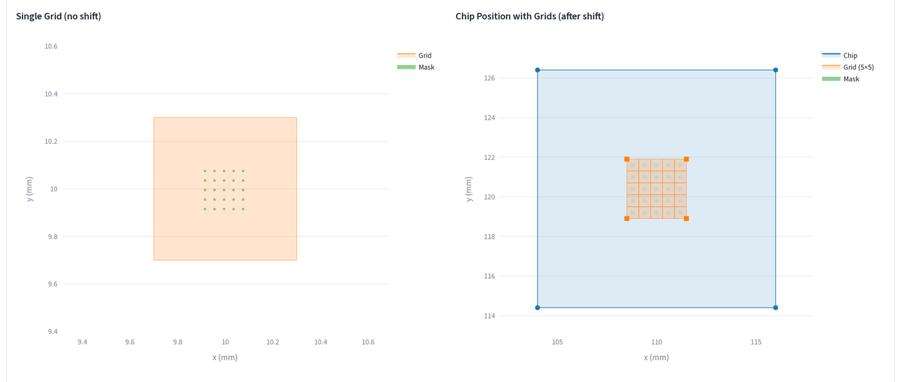
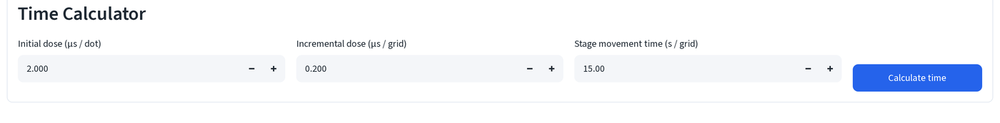
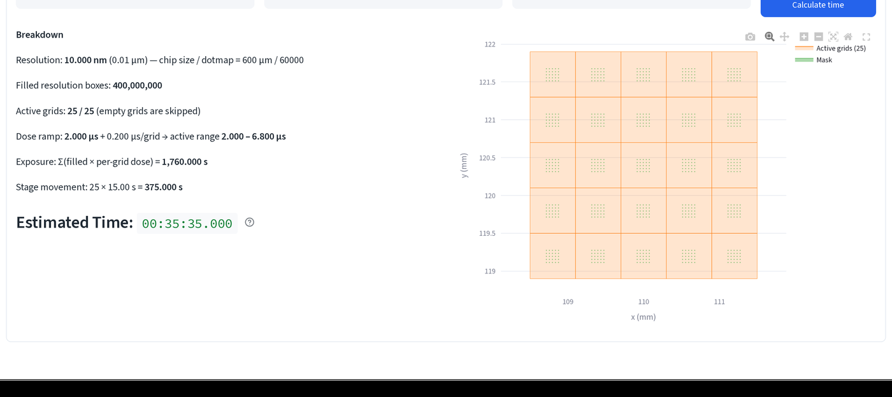

# Dose-time test

Expose the same pattern at a range of doses on one chip, then read the
developed linewidths under the SEM to pick a working dose before committing
a real device to it.

Read [EBL calculator basics](index.md) first if you haven't opened this page
before; this walkthrough picks up after a mask is loaded.

## 1. Load the mask and pick a layer

Upload the `.gds` file, then set your **Layer to expose**.

## 2. Position the pattern in the write field

Pick **Dose Time Testing** under **Workflow**. Type the **Cel Origin (mm) in job1** x and y here. This is where the mask's GDS `(0,0)` lands on.

Typically the Cel Origin is at (9.7, 9.7), so the pattern is shifted by (9.7, 9.7).

## 3. Grid geometry setup

Set up **Increment (mm) in job3** (dx, dy) and **Grid Count in job3** (Nx, Ny). dx/dy auto-track the chip size (default is 600 µm). **Initial Shift (mm) in job3** is computed automatically to center the array on the chip. 

The left plot is one tile (grid) at the Cel Origin you just set, with no replication, check the mask lands inside the orange box here first.

The right plot is the full 5×5 array over the chip, after the auto-centering shift.

## 4. Set the dose ramp

Under **Time Calculator**, type in your **Initial dose (μs / dot)**, **Incremental dose (μs / grid)** and **Stage movement time (s / grid)**, then click **Calculate time**.

Each of the tiles gets its own dose. The bottom left tile gets the shortest dose (initial dose), the top right tile gets the longest.

## 5. Read the exposure time per dose step

The **Dose ramp** line is the one to check: `2.000 μs + 0.200 μs/grid → active range 2.000, 6.800 μs`, the lowest and highest per-tile dose actually used, in iteration order across the 25 tiles. **Estimated Time** at the bottom (`00:35:35.000`) shows how long the exposure will take. See [job number sheet](job-sheet.md) for where each of these numbers lands in the JEOL system.

## Setup Instruction
Tip: Open **Setup Instruction** in **Left Computer Setup** section. It summarizes your steps and the numbers required in the left-side computer.

