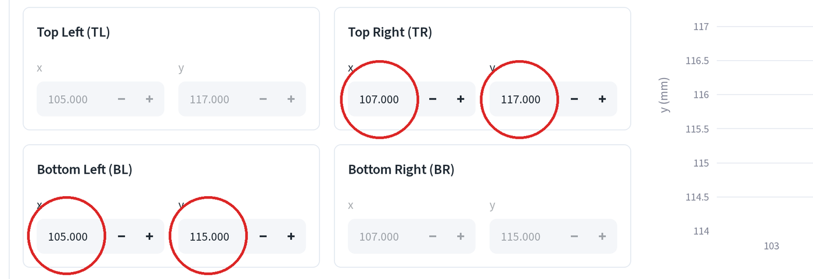
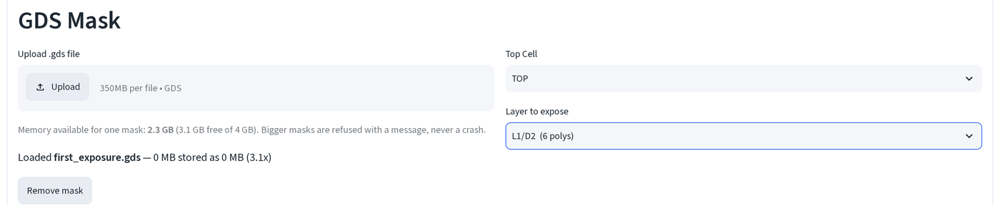
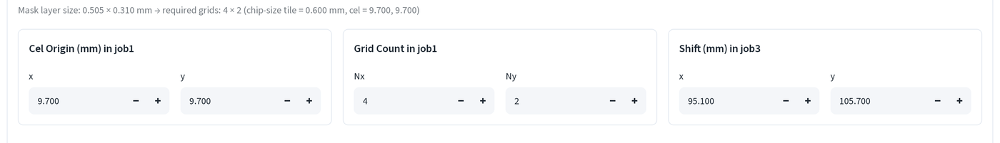
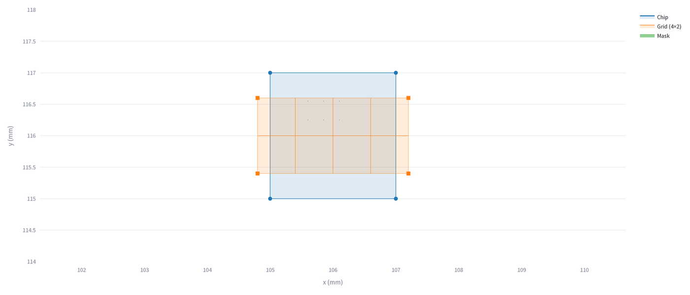
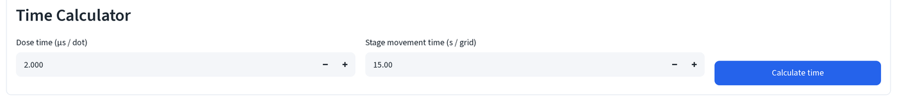
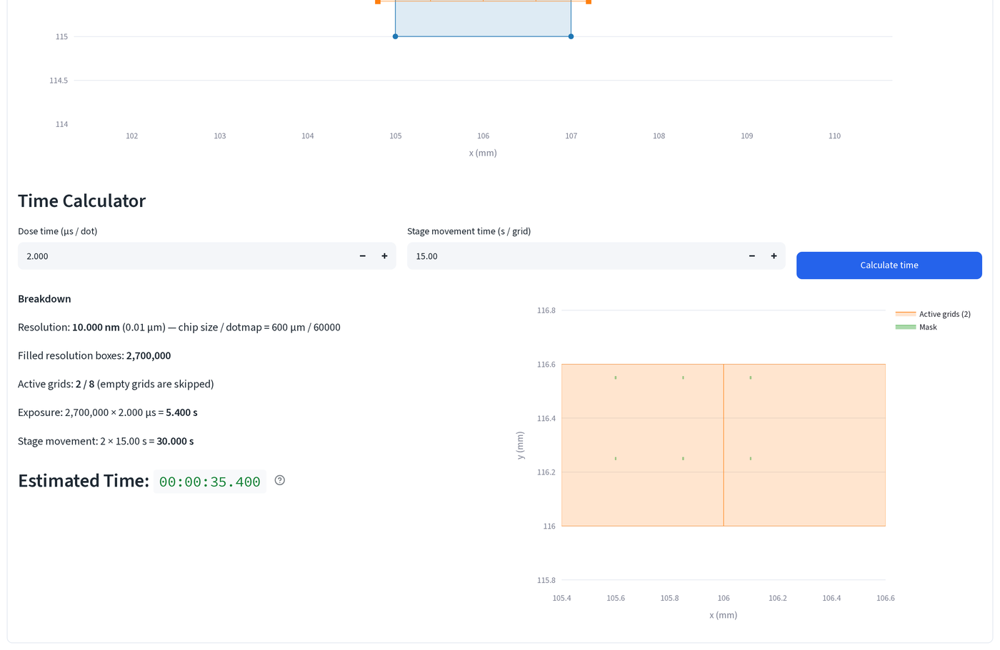

# First exposure

Write the first pattern onto a bare chip: no marks, no registration to
anything already there, the write field is just tiled with chip-size grids
and centered on the chip. This page walks the **First Exposure** mode with
`first_exposure.gds` (six devices, base pads / emitter fingers / collector
pads each on their own datatype, plus four alignment marks reserved for the
[second exposure](second-exposure.md) that follows this one).

Read [EBL calculator basics](index.md) first if this is your first time on
this page. **Every field below keeps its default value except the two
positions you're told to type**, everything else is either auto-computed
from the mask or left alone on purpose; each screenshot says which.

## 1. Set the chip corners you actually found

Before touching the mask, **Chip Position in the E-beam Holder** needs to
match where the chip really sits in the holder today, not the boilerplate
default. Say, for example, you found the chip's bottom-left corner at stage
position (105.000, 115.000) mm under the beam:

1. Type that into the **Bottom Left (BL)** x/y fields.

Then you locate the top-right alignment mark, near the chip's top-right
corner, at design coordinates (1900, 1900) µm on this mask, and read its
stage position as (107.000, 117.000) mm:

2. Type that into the **Top Right (TR)** x/y fields.

**Top Left (TL)** and **Bottom Right (BR)** are grayed out and computed for
you, with **Shape = Rectangular** and **Editable diagonal = BL / TR** (both
defaults), the other diagonal is derived automatically. Don't touch them.

## 2. Load the mask and pick a layer

3. Upload `first_exposure.gds`, then set **Layer to expose** to `L1/D2` (6
   polys), the emitter fingers, the finest-pitch feature on this mask and
   the one dose matters most for.

This mask keeps base pads, emitter fingers and collector pads on separate
datatypes (`L1/D1`, `L1/D2`, `L1/D3`). Each gets exposed as its own pass. This walkthrough covers one; repeat for the others with the same corners and
Cel Origin.

## 3. Leave the grid geometry on auto

4. Pick **First Exposure** under **Workflow**. **Cel Origin (mm) in job1**,
   **Grid Count in job1** (Nx, Ny) and **Shift (mm) in job3** are all
   computed for you from the mask's bounding box and the chip corners you
   set in step 1, leave all three alone.

The caption above the cards spells out the arithmetic: this mask layer is
0.505 × 0.310 mm, which needs a 4×2 grid of 0.600 mm tiles at the default
Cel Origin (9.700, 9.700) to fully cover it. Change the layer, the chip
corners, or the chip size in **Left Computer Setup**, and these three cards
recompute, that's why they're left on auto instead of typed by hand.

## 4. Check the plot

The chip rectangle now reflects the corners from step 1, the grid is
centered on it, and the emitter mask (barely visible at this scale, six
4, 5 µm-wide slivers) lands across two of the eight tiles.

## 5. Set the dose and read the time

5. Under **Time Calculator**, leave **Dose time (μs / dot)** and **Stage
   movement time (s / grid)** at their defaults (2.000, 15.00) and click
   **Calculate time**.

Only 2 of the 8 tiles hold any emitter geometry (**Active grids: 2 / 8**); the rest are skipped, so exposure and stage-movement time only count the
tiles that actually have pattern in them. **Estimated Time** is what goes on
the job sheet, see the [job number sheet](job-sheet.md) for where every
number from this page and [dose test](dose-test.md) lands in the JEOL
system, in order.
