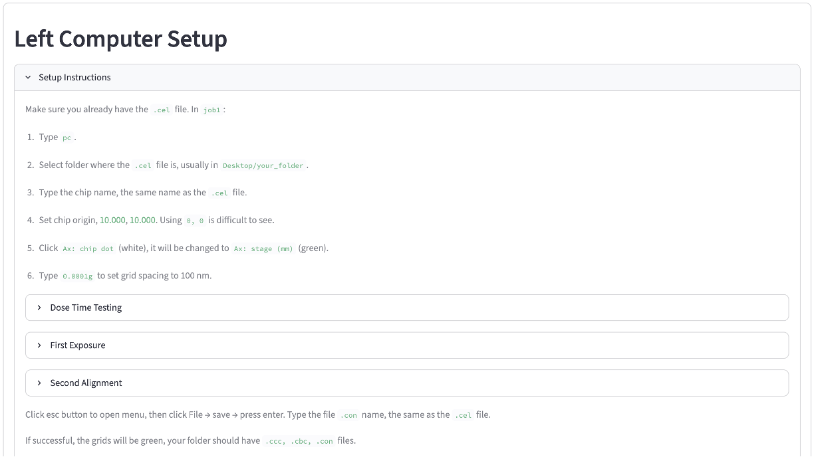

# 首次曝光

在裸晶片上寫下第一個圖案：沒有標記，不對準任何已存在的東西，寫入場只是鋪滿
晶片尺寸的網格並置中於晶片上。本頁走一遍 **首次曝光 (First Exposure)** 模式，
使用 `first_exposure.gds`（中央有圖案，另外還有四個對準標記，留給接下來要
做的[二次曝光](second-exposure.md)使用）。

如果這是你第一次來這一頁，請先讀[電子束微影計算機基礎](index.md)。

## 1. 輸入你實際找到的晶片角落

這組輸入用來把圖案置中到你的元件上。**夾具中的晶片位置 (Chip Position in the
E-beam Holder)** 必須符合晶片實際放在夾具裡的位置。假設你在載台位置
(104.000, 114.400) mm 下找到晶片的左下角，把這組數字輸入 **左下 (BL)
(Bottom Left (BL))** 的 x/y 欄位。

接著找出你元件的右上角並讀出它的載台位置，本例為 (116.000, 126.400) mm，
把這組數字輸入 **右上 (TR) (Top Right (TR))** 的 x/y 欄位。

**左上 (TL)** 與 **右下 (BR)** 呈灰色禁用，由系統自動算出，搭配 **形狀
(Shape) = 矩形 (Rectangular)** 與 **可編輯對角 (Editable diagonal) = BL /
TR**，另一組對角會自動推算。

## 2. 載入遮罩並選圖層

上傳你的 `.gds` 檔案，然後設定 **要曝光的圖層 (Layer to expose)**。

## 3. 網格幾何參數維持自動

在 **曝光流程 (Workflow)** 底下選 **首次曝光 (First Exposure)**。**job1 中的
Cel 原點 (mm) (Cel Origin (mm) in job1)**、**job1 中的網格數量 (Grid Count
in job1)**（Nx、Ny）與 **job3 中的位移 (mm) (Shift (mm) in job3)** 全部由
遮罩的邊界框與你在步驟一設定的晶片角落自動算出。

應用程式會使用 0.600 mm 的區塊，配預設 Cel 原點 (9.700, 9.700) 來完全覆蓋。
改變圖層、晶片角落，或在 **左側電腦設定 (Left Computer Setup)** 裡改變
晶片尺寸，這三張卡片都會自動重新計算。

## 4. 檢查圖

晶片矩形現在反映步驟一的角落，網格置中於其上。你可以視需要修改。

## 5. 設定劑量並讀出時間

在 **曝光時間計算 (Time Calculator)** 底下，輸入你的 **劑量時間 (μs / dot)
(Dose time (μs / dot))** 與 **載台移動時間 (s / grid) (Stage movement time
(s / grid))**，然後按 **計算時間 (Calculate time)**。

<!--  -->

**有效網格數 (Active grids)** 只顯示有曝光圖案的網格；其餘的會被跳過，所以
曝光與載台移動時間只計入真正有圖案的區塊。**預估時間 (Estimated Time)**
反映曝光完成所需的時間。

見[工作編號表](job-sheet.md)依序看本頁與[劑量時間測試](dose-test.md)的
每個數字各自落在 JEOL 系統的哪個欄位。

## 設定說明

小提示：開啟 **左側電腦設定 (Left Computer Setup)** 區塊中的 **設定說明
(Setup Instruction)**。它會彙整你的步驟與左側電腦所需的數字。

