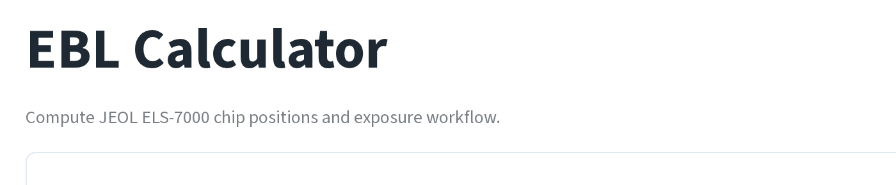
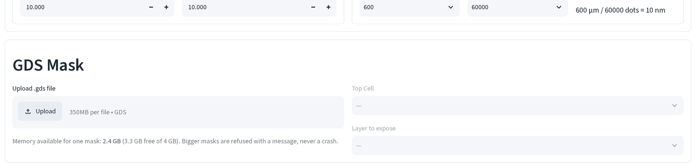
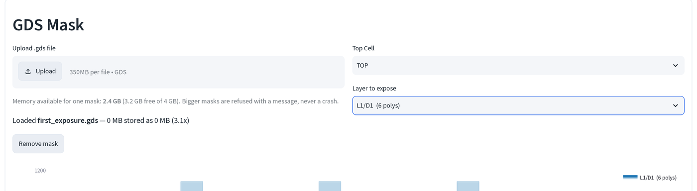
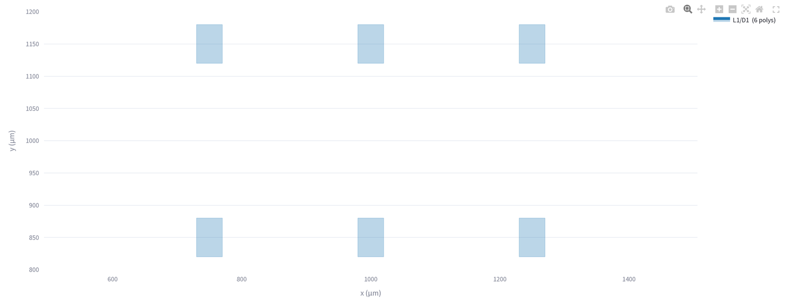
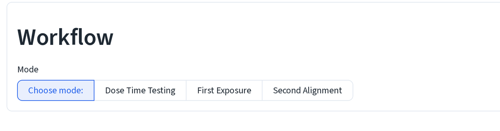

# EBL calculator basics

Compute JEOL ELS-7000 chip positions and exposure jobs from a GDS mask. This
page covers opening the tool, loading a mask, and reading the viewer, the
three workflow pages that follow ([dose test](dose-test.md),
[first exposure](first-exposure.md), [second exposure](second-exposure.md))
each build on what's here.

## 1. Open the calculator

The EBL Calculator lives in the portal sidebar, under **Process**. It also
runs on its own, outside the portal: `python launch_ebl_calculator.py` builds
a local virtual environment next to itself, installs the packages the page
needs, and launches it directly at `tools/process/ebeam/calculator.py`. Standalone
mode has no password gate and no other tools in the sidebar, just this page.

Standalone mode also raises the upload cap. The portal caps uploads at 350 MB
(sized for the deployed container); `launch_ebl_calculator.py` sizes the cap
from the workstation's own RAM instead, up to 4 GB.

## 2. Upload a mask

1. Drop a `.gds` file on **Upload .gds file**, under **GDS Mask**.

The line under the uploader, **Memory available for one mask**, is not a
fixed number. It's read from free RAM at that moment, so the same file can
load on an idle machine and get refused an hour later on a busy one. Above
that budget, the app does one of two things, never a crash:

- **Too big to hold, small enough to measure**: the mask is streamed instead
, read back in ~4 MB blocks, keeping only reductions (bounding boxes,
  coverage), so you still get the overview and an exact time estimate, with
  a warning that says so.
- **Too big for either**: a plain error message names the problem (corrupt
  file, or a budget too small even for streaming).

The demo masks used across these pages are a few KB each, so this line will
always read a boring **0 MB stored as 0 MB**, the ratio and the presence of
the line are what to check, not the magnitude.

## 3. Pick the cell and layer

2. Once a file parses, **Top Cell** and **Layer to expose** fill in. Pick the
   top-level cell, then the `(layer, datatype)` pair you want to look at or
   expose next.

Only one `(layer, datatype)` pair is shown at a time. If your mask splits a
job across several datatypes (marks on one, pads on another, fine features on
a third, as the demo masks in this guide do), you pick one at a time.

## 4. Read the viewer

3. The plot below the selectors draws the selected layer. Small layers (under
   50,000 polygons) draw every polygon exactly, as here, six base pads from
   the demo first-exposure mask:

Past 50,000 polygons the page stops drawing every shape (the browser would
stall) and switches to a low-resolution coverage raster instead, with a
checkbox to force full detail anyway. Drag a box on a dense layer's overview
to re-read just that region at full detail, useful for checking one device
in a mask with thousands.

## Three ways to use this page

Once a mask is loaded, the **Workflow** section at the bottom picks what the
rest of the page does with it:

**Dose Time Testing** replicates one mask across a grid of stage positions,
ramping the dose from tile to tile, so you can pick a working dose off the
developed result before committing a real device to it, see
[dose test](dose-test.md).

**First Exposure** tiles the write field with same-size grids and centers
them on the chip, with no marks involved, the first pattern written on a
bare chip. See [first exposure](first-exposure.md).

**Second Alignment** registers a new layer to marks already on the chip from
a prior exposure, so the new pattern lands where it needs to relative to
what's already there. See [second exposure](second-exposure.md).

For the numbers to type into the JEOL system for all three, in order, see the
[job number sheet](job-sheet.md).
