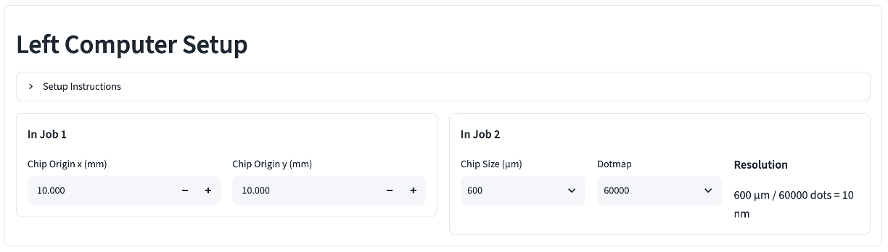
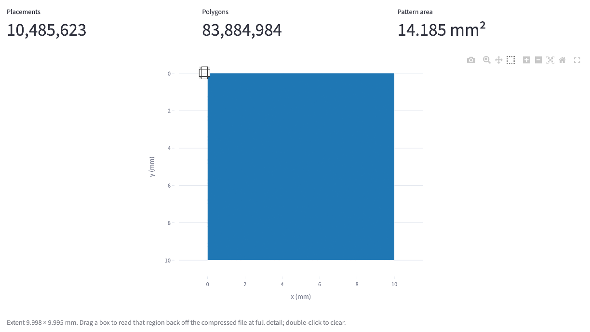
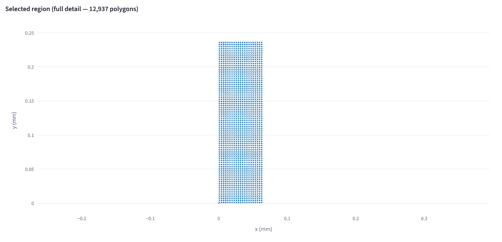

# EBL calculator basics

Compute JEOL ELS-7000 chip positions and exposure jobs from a GDS mask. This
page covers opening the tool, loading a mask, and reading the viewer, the
three workflow pages that follow ([dose test](dose-test.md),
[first exposure](first-exposure.md), [second exposure](second-exposure.md))
each build on what's here.

## 1. Open the calculator

In most cases, the [streamlit online web app](https://hbt-tools.streamlit.app/) is sufficient to process the mask files. If your mask file is larger than 350 MB, run the app locally:

1. Install python on your computer. On Windows, tick "add to PATH" during install.

2. Go to the [e-beam tools](https://github.com/ioedhbt/ebeam) or [HBT tools](https://github.com/ioedhbt/hbt-tools) Github repo, click the green "<> Code" button, then "download zip". Extract the zip to a folder.

3. Open a terminal or command prompt at the folder, and run `python launch_ebl_calculator.py` or `python3 launch_ebl_calculator.py`. It installs what the page needs and launches the app in a browser.

## 2. Left Computer Setup

Set the chip origin — where the grids will be positioned (default 10.0, 10.0). You can use other numbers, but not 0, 0; that puts the grid at the far left of the screen, where you cannot find it.

Then set the **Chip Size** and **Dotmap**. Chip size is how big each grid will be; dot map is how many dots (pixels) will be drawn on each grid. So the exposure resolution is chip size divided by dot map.

## 3. Upload a mask

Drop a `.gds` file on **Upload .gds file**, under **GDS Mask**. Once a file parses, **Top Cell** and **Layer to expose** fill in. Pick the top-level cell, then the `(layer, datatype)` pair you want to look at or expose next.

## 4. Read the viewer

The plot below the selectors draws the selected layer. Small layers (under 50,000 polygons) draw every polygon:

Past 50,000 polygons the viewer shows a low-resolution overview instead of
individual shapes. Drag a box on it to re-draw that region at full detail —
useful for checking one device in a mask with thousands.

## Three ways to use this page

Once a mask is loaded, the **Workflow** section at the bottom picks what the
rest of the page does with it:

**Dose Time Testing** exposes a mask pattern several times, ramping the dose from tile to tile, so you can pick a working dose off the developed result before committing a real device. See
[dose test](dose-test.md).

**First Exposure** exposes a mask file to a device without any mark alignment. You need to test the dose beforehand. See [first exposure](first-exposure.md).

**Second Alignment** exposes a mask file to a device with an existing mark for alignment. You need to test the dose beforehand. See [second exposure](second-exposure.md).

For the numbers to type into the JEOL system for all three, in order, see the
[job number sheet](job-sheet.md).

## Setup Instruction

Tip: Open **Setup Instruction** in **Left Computer Setup** section. It summarizes your steps and the numbers required in the left-side computer.

