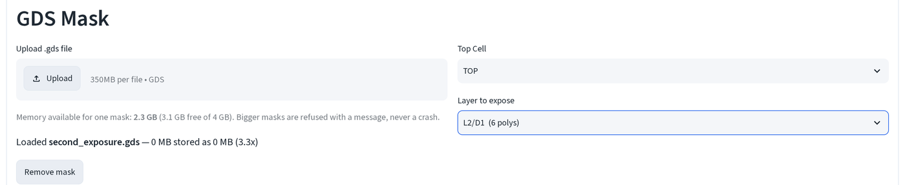
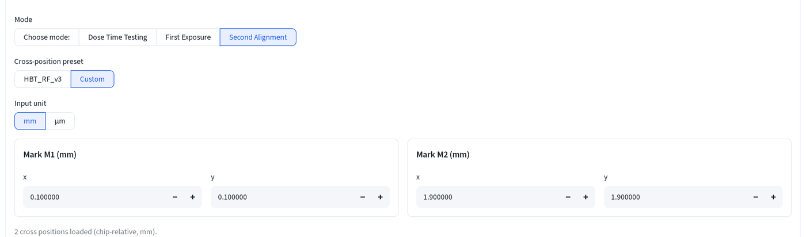
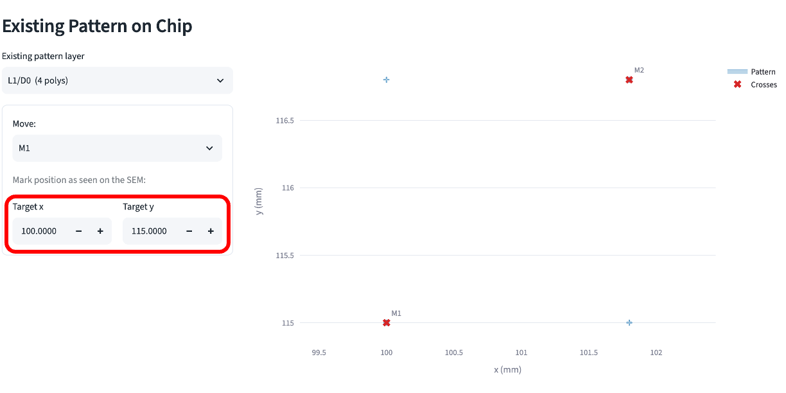
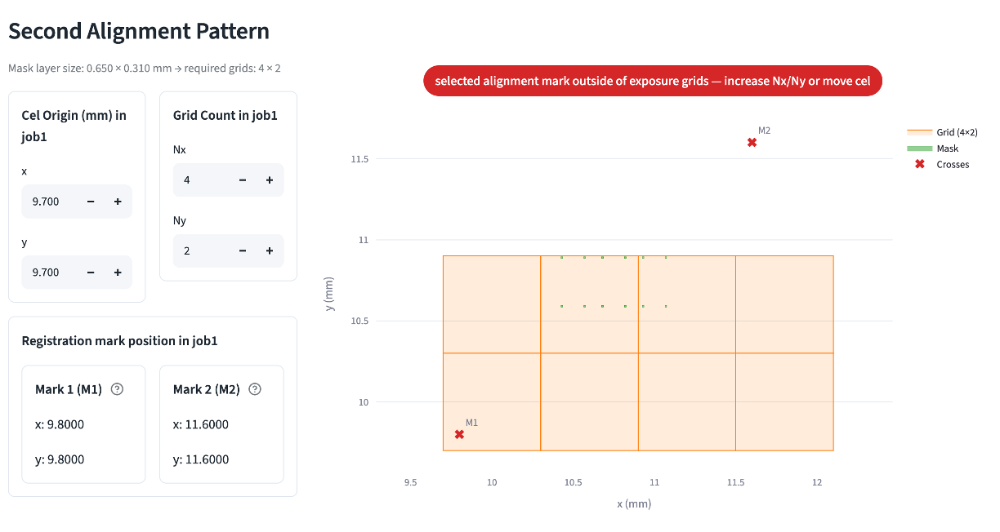
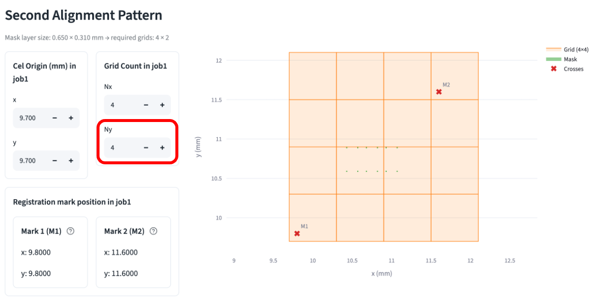
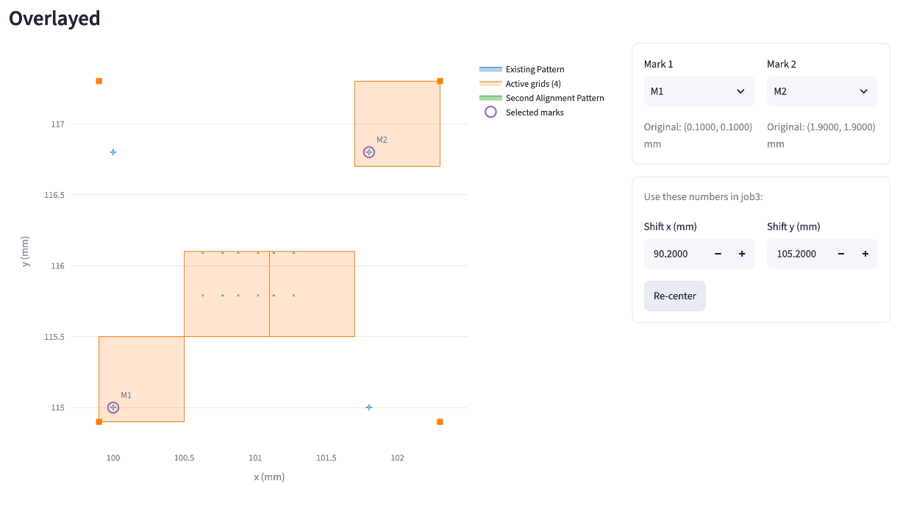
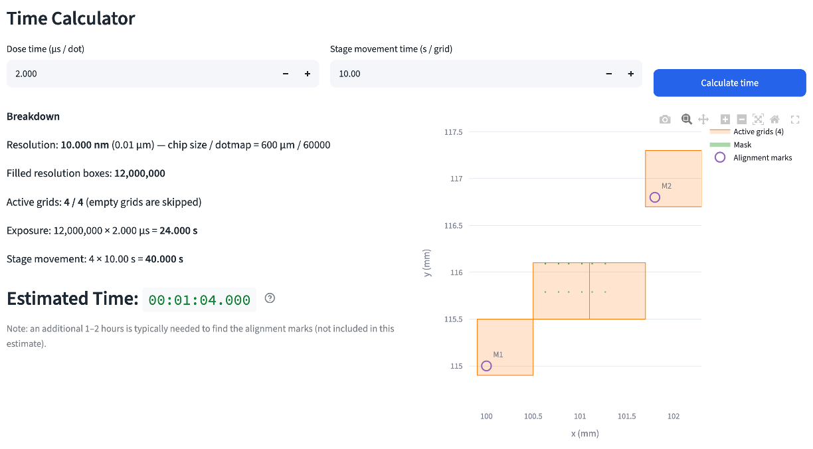

# Second exposure

Expose a new layer to a device with marks already written on the chip in a prior exposure, so it lands where it needs to relative to what's already there.

Read [EBL calculator basics](index.md) first if this is your first time on this page.

## 1. Load the mask and pick the pattern layer

Upload your `.gds` file, then set a **Layer to expose**.

## 2. Set the mark design positions

Pick **Second Alignment** under **Workflow**, then **Custom** under **Cross-position preset**, and type in the mark positions for your mask. Prefer two marks placed diagonally from each other rather than vertically or horizontally.

These numbers are where the marks sit in the mask design — check your `.gds` file in KLayout or ADS and type them in. Next you tell the tool where they actually landed on the physical chip.

## 3. Enter the mark position found on the device under SEM

Under **Existing Pattern on Chip**, set **Existing pattern layer** to your first-exposure pattern.

Say you find the M1 mark under the SEM at stage position (100.0, 115.0) mm. Type both numbers into **Target x and y**. This moves M1 from its mask position to the real stage position, and M2 follows automatically. Hover over the plot to check the positions.

## 4. Fix the grid so both marks are inside it

**Grid Count in job1** (Nx, Ny) dictates how many grids are created in x and y direction. If pattern is found outside of the selected grid size, the app will give a warning:

In this case, fix it by hand: increase **Ny** from 2 to **4**.

The **Registration mark position in job1** panel below now shows both marks
in job1 stage coordinates: Mark 1 (M1) at (9.8000, 9.8000), Mark 2 (M2) at
(11.6000, 11.6000). This is mark design position plus Cel Origin.

## 5. Read the Overlayed result

Scroll to **Overlayed**. **Mark 1** and **Mark 2** default to `M1` / `M2`. **Shift x (mm)** / **Shift y (mm)** are computed for you. Make sure they are overlayed correctly.

**Shift x/y** is the number that goes on the job sheet for job3.

## 6. Set the dose and read the time

Under **Time Calculator**, type in the **Dose time (μs / dot)** and **Stage movement time (s / grid)** (typically 10~15 s) and click **Calculate time**.

The app will estimate the required time for exposure. For second alignment, finding/registering the alignment marks under the SEM typically **adds another 1~2 hours**  on top of this time estimate.

See the [job number sheet](job-sheet.md) for the summary of numbers used in the setup.

## Setup Instruction

Tip: Open **Setup Instruction** in **Left Computer Setup** section. It summarizes your steps and the numbers required in the left-side computer.

