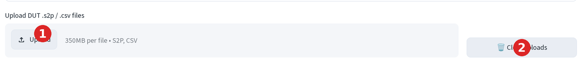
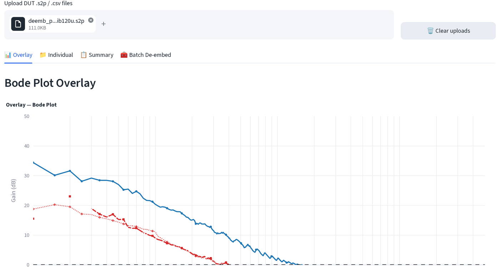
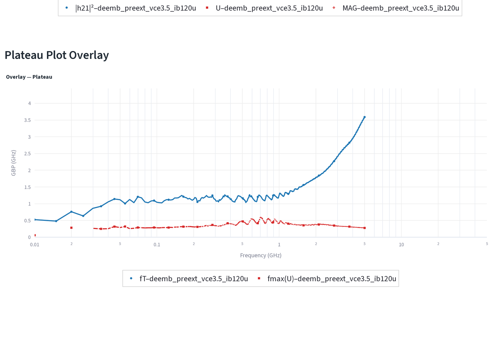
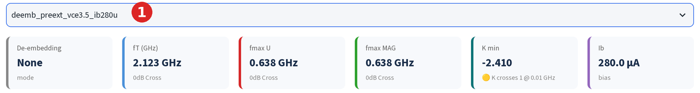
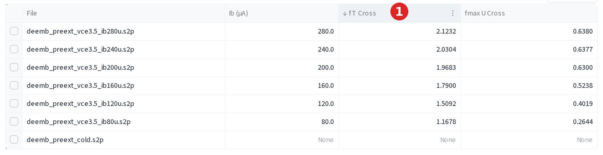
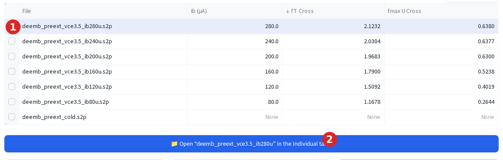

# RF 一覽

批次上傳元件、去嵌入，並一次讀出 fT/fmax。

## 上傳

1. 點選**上傳 (Upload)**，拖入 DUT 的 `.s2p` 或 `.csv` 檔案，每個偏壓點一檔，
   一次可放入任意數量。
2. 點選**清除上傳 (Clear uploads)** 移除所有已上傳的檔案，重新開始。

每個檔案會依內容雜湊值，加上目前的去嵌入與圖表視窗設定進行快取，所以重新
執行頁面（拖動滑桿、切換勾選框）時，未變更的檔案不會重新解析。

## 四個分頁

1. **疊圖 (Overlay)**：將每個已上傳檔案的 Bode 與 Plateau 曲線疊在同一軸上，
   方便一眼比較各元件。
2. **單一檔案 (Individual)**：一次一個檔案，顯示 Bode、Plateau 與 Smith
   圖、fT/fmax 指標卡、資料表與匯出功能。
3. **摘要 (Summary)**：每個檔案一列，列出 fT/fmax，可排序，並可匯出
   Excel/ZIP。
4. **批次去嵌入 (Batch De-embed)**：對每個已上傳檔案套用同一組校準的
   Open/Short 去嵌入。另有專頁說明。

疊圖分頁的兩張圖表垂直排列，上方為 Bode（|h21|²、Mason U、MAG/MSG 對頻率），
下方為 Plateau（`f × 增益`，即同一資料的 GBP 形式）。每個已上傳檔案在兩張
圖上都各自有一組曲線，因此多個偏壓點的掃描可以直接疊圖比較：

## fT/fmax 萃取

每張指標卡顯示數值以及產生該數值的方法。

應用程式依序嘗試：

1. **交越 (0dB Cross)**：真正的 0 dB 交越，即增益曲線在跌破 0 dB 之前，
   至少連續 10 個點維持在 0 dB 以上。只要存在這種交越，就會顯示此數值。
2. **外插 (Extrap & Plat.)**：在掃描頻段內找不到交越，但中位增益仍為正值，
   於是對最後幾個點做對數線性擬合，並外插到其 0 dB 交越點。
3. **平台 (Plateau)**：與外插值並列顯示，作為健全性檢查：逐點計算
   `f × |增益|`，對正常運作的元件而言應接近外插所得的 fT/fmax。

**無增益 (No Gain)** / **無資料 (No Data)** 表示曲線在掃描頻段內從未突破
0 dB，這對未偏壓或冷態元件而言是正常現象（見上方卡片：`2.123 GHz`，方法為
`0dB 交越`）。

## 排序與跳至元件

在摘要分頁依 fT 或 fmax 為元件排名，再直接在單一檔案分頁開啟想看的那個，
不必從下拉選單重新選取。

1. 點選 **fT Cross**（或任一）欄標題依該欄排序，再次點選則反轉排序方向。

    

2. 點選某列的核取方塊選取該列，再點選出現的藍色**在單一檔案分頁開啟「…」→
   (Open "…" in the Individual tab →)** 按鈕。

    

## 匯出

摘要分頁可匯出整張表：

1. 點選 **Excel** 取得多工作表活頁簿，一張 `Summary` 工作表加上每個元件各一
   張工作表。
2. 點選 **ZIP (CSV)** 取得相同資料的純 CSV 檔案。
3. 點選**複製 (copy)** 將摘要表複製到剪貼簿，方便貼到 Origin。

單一檔案分頁的 Bode 圖下方也有同樣的兩個按鈕（Plateau 與 Smith 圖則不提供
匯出）：

1. 點選 **xlsx** 將繪製的曲線下載為活頁簿。
2. 點選**複製 (copy)** 將同一份資料複製到剪貼簿，直接貼到 Origin，不必下載。

## 將元件傳送至萃取或模擬頁

在單一檔案分頁中，可將目前使用中的元件直接傳送出去，不必重新上傳。

1. 點選**→ 小訊號模型萃取 (→ SSM Extraction)**，開啟已載入此元件 S 參數的
   HBT SSM 萃取頁。
2. 點選**→ 模擬與擬合 (→ Simulation & Fitting)**，開啟已載入同一元件的
   RF 模擬器以進行擬合。

若此檔案已執行過三步驟或批次去嵌入，會先出現**傳送的 S 參數 (S-parameters
to send)** 選項，可選擇去嵌入後（已移除焊墊/引線，只擬合本質元件）或原始
（連寄生效應一併擬合）。
