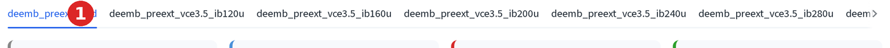

# Batch de-embedding

Run the same Open/Short de-embedding as the previous page across every
uploaded DUT file at once, instead of one file at a time.

## When to use it

Use the **Batch De-embed** tab whenever you have more than one bias point
against a single Open/Short calibration pair, the common case for a
device sweep (several `Ib` or `Vce` points, one probe pad layout). It runs
the same modeled extraction described on the
[Open/short de-embedding](deembedding.md) page, once, and applies it to
every file in the main uploader in one pass.

## Setup

Same as the 3-step page: turn on **② Device Dummy (Open-Short)** in the
sidebar, drop the Open and Short files, then upload as many DUT files as
you want de-embedded through the main **Upload DUT .s2p / .csv files** box.
With all 7 demo bias sweep files loaded, the Batch De-embed tab lists one
sub-tab per file:

Each sub-tab has the same fT/fmax cards and Bode/Smith charts as the
[single-device walkthrough](deembedding.md#before--after-on-the-device).
The Cpbe/Cpce/Cpbc/Lb/Lc/Le override fields and the Modeled/Measured source
choice apply to every file identically; there is one calibration, not one
per device.

## Output ZIP

1. Click **📥 Download de-embedded measurement files**.

    

The ZIP contains one `.s2p` per uploaded file, named `<original stem>_deemb.s2p`
(`deemb_preext_vce3.5_ib280u.s2p` → `deemb_preext_vce3.5_ib280u_deemb.s2p`).
Each file's header carries the parasitic values that were subtracted from
it, Cpbe, Cpce, Cpbc in fF, Lb, Lc, Le in pH, Rb, Rc, Re in Ω, so the
de-embedding a given file went through stays traceable from the file alone.

## Handing devices onward

The same container offers a handoff to the SSM pages, but batched: pick one
**Primary device** from a dropdown, then

- **→ SSM Extraction** sends the primary device *and* every other
  de-embedded file as extras, Extraction's Z-parameter, Cold-HBT and
  τ_total methods can use them.
- **→ Simulation & Fitting** sends only the primary device.

This is the same container shown de-embedded on the
[single-device walkthrough](deembedding.md#before--after-on-the-device),
just backed by every uploaded file instead of one.
