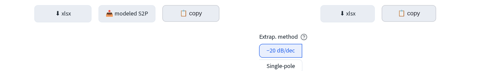
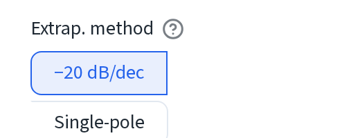
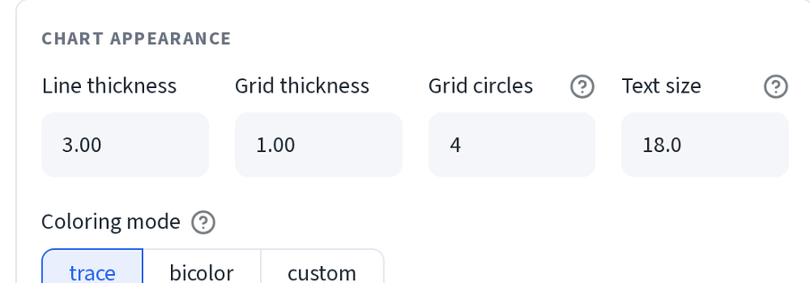
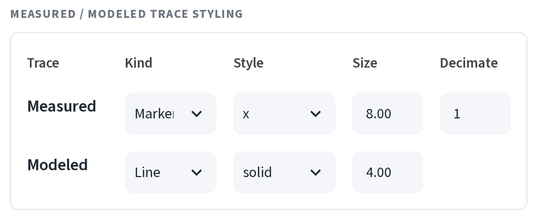
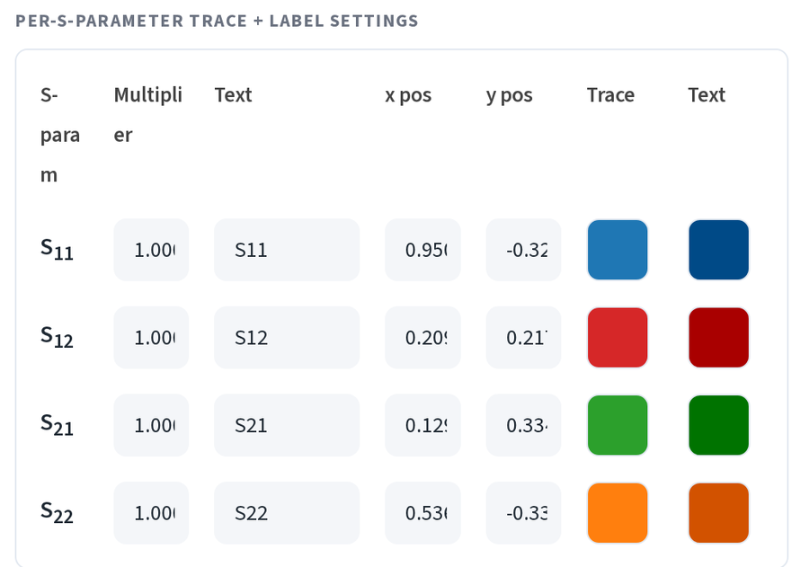
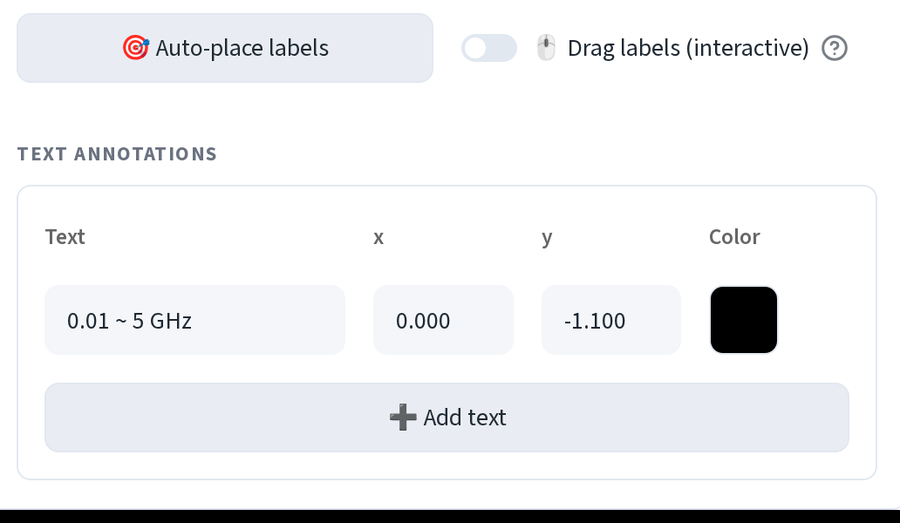
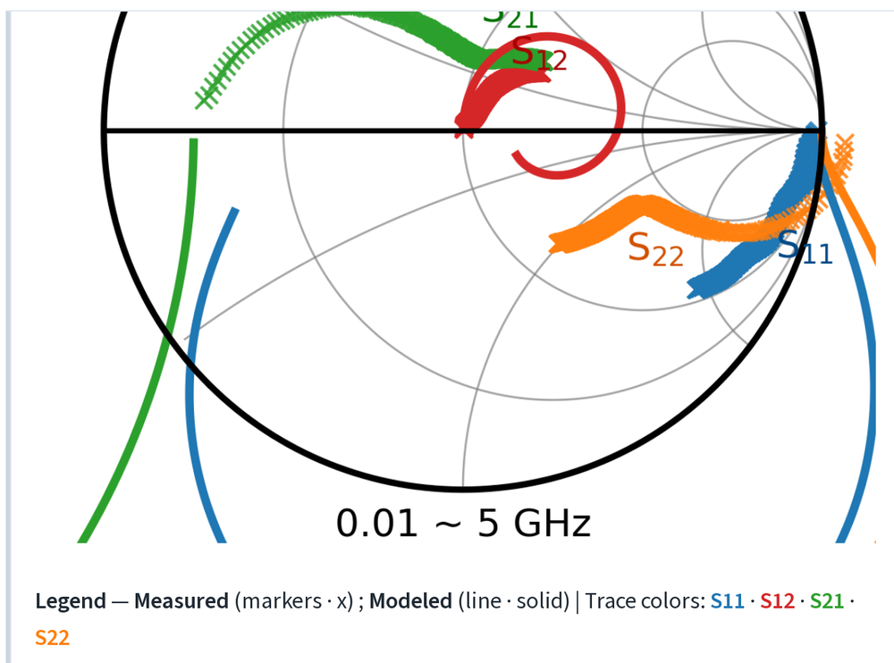

# Chart controls

Getting a figure out of the app that you can put in a thesis without redrawing
it. Everything here lives on **SSM Simulation & Fitting**, in the
**🍩 Smith Chart (Matplotlib)** expander. That is the publication renderer,
separate from the interactive Plotly chart above it.

## Export from any chart

- **xlsx**: the plotted data as a spreadsheet.
- **modeled S2P**: the fitted model as a Touchstone file.
- **copy**: click this to copy the data to your clipboard for easy pasting in
  Origin.

Every chart in the app carries the same row, so this is also how you get the
extraction plots and the DC curves out.

## Extrapolation method

f_T and f_max are usually past the top of the measured band, so both are
extrapolated. **−20 dB/dec** fits the classic single-slope roll-off;
**Single-pole** fits a pole model instead. They disagree most when the
measurement stops well below f_T. If the two answers are far apart, say which
one you used.

## Appearance

- **Line thickness** and **Grid thickness** in points.
- **Grid circles**: how many constant-resistance circles to draw. Fewer is
  usually more readable in print.
- **Text size**: applies to the S-parameter labels and annotations.
- **Coloring mode**: `trace` gives each S-parameter its own colour, `bicolor`
  uses one colour for measured and one for modelled, `custom` hands you the
  per-trace colour pickers below.

## Trace style

One row for measured, one for modelled.

- **Kind**: Markers or Line.
- **Style**: the marker symbol (`x`, `o`, …) or the line style (solid,
  dashed, …).
- **Size**: marker size or line width.
- **Decimate**: plot every *n*th point. Raise it when 1001 markers turn the
  trace into a solid band.

The convention the app ships with, measured as `x` markers, modelled as a
solid line, is the one most readers expect. Change it only if you have a
reason.

## Per-S-parameter settings

| Column | What it does |
|---|---|
| **Multiplier** | Scales that trace before plotting. Use it to lift S12 to a readable size next to S21. Display only; it does not change the residual. |
| **Text** | The label drawn on the chart. Defaults to `S11`, `S12`, … |
| **x pos**, **y pos** | Where that label sits, in Γ coordinates. |
| **Trace** | The trace colour swatch. |
| **Text** (colour) | The label colour, usually a darker shade of the trace. |

## Moving the labels

1. Click **🎯 Auto-place labels** to have the app position all four for you.
2. Turn on **Drag labels (interactive)** and drag any label where you want it.
   The x/y boxes above update as you drag, so you can drag roughly and then
   type an exact number.

**Text annotations** at the bottom adds free text. The `0.01 ~ 5 GHz` caption
on the chart below is one of these. Give it a string, an x, a y and a colour,
then **+ Add text** for another.

