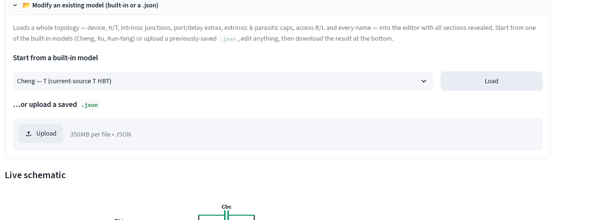
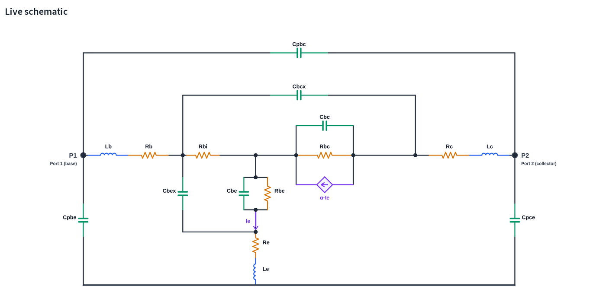
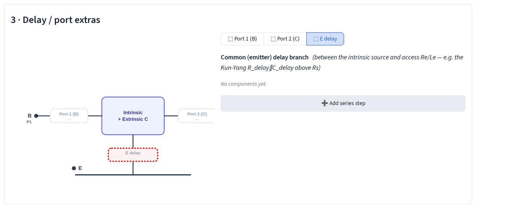
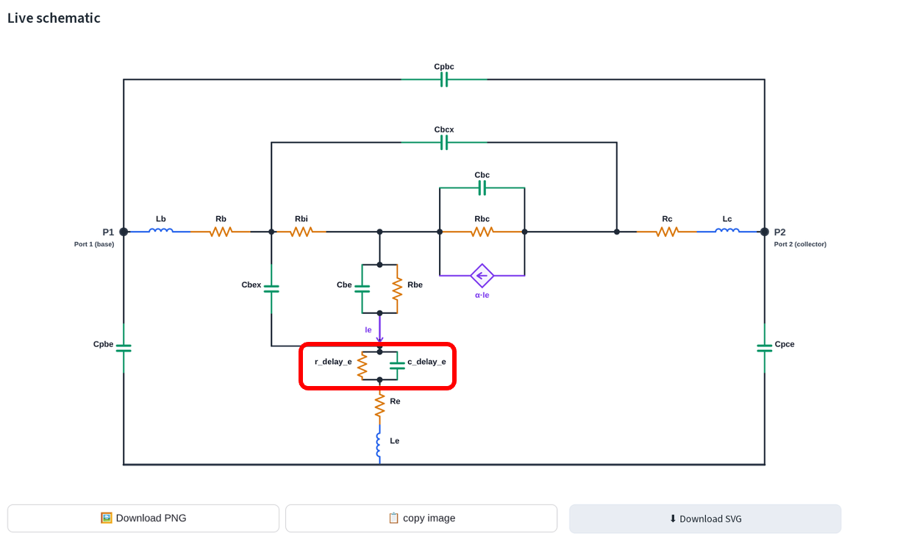
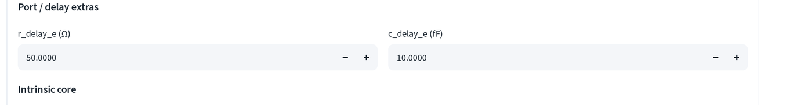
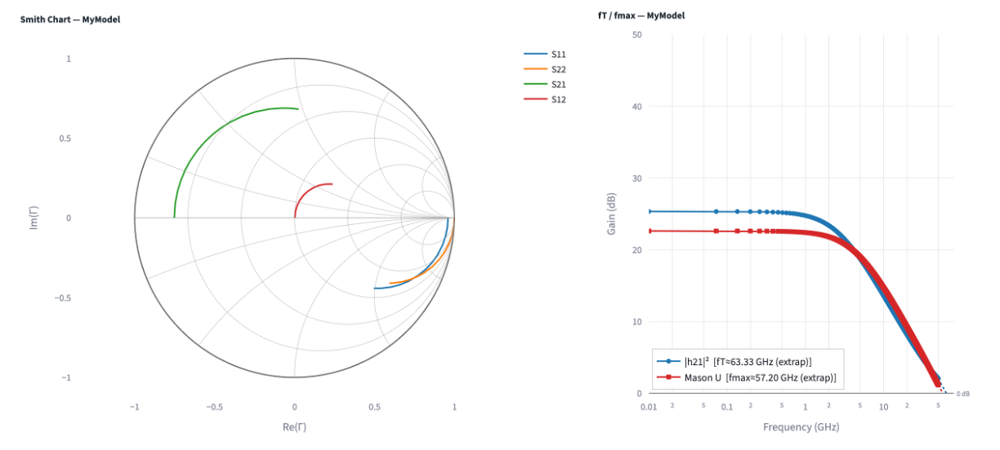

# Custom models

Build a small-signal topology component-by-component instead of picking one
of the four built-in models. Open **SSM Simulation & Fitting**, click the
**🧩 Custom model** chip, then choose **Build model**.

## What it does

Every branch you draw, R, L, C, in any series/parallel combination, becomes
a 2-terminal network between two named nodes, plus one intrinsic π or T
controlled-source core. A live SVG schematic redraws above the controls
after every edit, so you can see the topology you're building before you
simulate anything.

The builder reveals five sections **inside → outward**, one at a time:
device + intrinsic core, extrinsic caps, delay/port extras, access R + lead
L, parasitic pad caps. Confirm a section to reveal the next, or open **📂
Modify an existing model** to load one of the built-ins (Cheng T/π, Xu T,
Kun-Yang HEMT) or a previously-saved `.json` with **every** section already
revealed, ready to edit anywhere.

## Worked example: Cheng's T + an emitter delay branch

Start from Cheng's T topology and add a resistor and capacitor in parallel
between the intrinsic emitter and the access Re/Le.

Under **📂 Modify an existing model**, pick **Cheng, T (current-source T
   HBT)** from **Start from a built-in model** and click **Load**.

Loading a preset reveals every section at once and redraws the schematic, Cbex, Cbe∥Rbe, Cbc∥Rbc behind the α·Ie source, Cbcx, the access network, and
the three pad caps:

Scroll to **3 · Delay / port extras** and click the **E delay** chip,    the common (emitter) delay branch, empty by default.

Click **➕ Add series step**, then **➕ R (parallel)** and **➕ C
   (parallel)** inside that step, both land in the same parallel group, so
   they sit in parallel with each other and in series with the rest of the
   emitter leg.
Rename the two `name` fields to `r_delay_e` and `c_delay_e`.

The schematic now shows the new branch between the intrinsic emitter (the
`Ie` current-source tap) and `Re`/`Le`:

`r_delay_e` and `c_delay_e` roll off the emitter's high-frequency
response: `c_delay_e` shorts out `r_delay_e` above its corner frequency,
adding a pole to the emitter access path.

## Saving, reusing and fitting

At the bottom of the builder, **💾 Save / use model**:

- **⬇ Download .json** saves the topology (structure + names, no values) to
  your machine.
- **📤 Send to Simulate / Fit view** loads it straight into the **Simulate &
  fit** tab without a re-upload, and downloads the `.json` alongside it.

The **Simulate & fit** tab asks for one value per named component, grouped
outside→inside (parasitic pads → lead L → access R → extrinsic caps →
port/delay extras → intrinsic core), `r_delay_e` and `c_delay_e` show up
under **Port / delay extras**:

Typed values simulate immediately, Smith chart and fT/fmax on the right,
same layout as every built-in model:

Upload a measured `.s2p` in **📂 Fit to a measured device** (top of the page,
same control as the built-in models) to overlay it and fit; the residual
readout, [visual tuning and auto tuning](tuning.md) all work identically on
a custom model.

Next: [visual & auto tuning](tuning.md) · [chart controls](charts.md).
