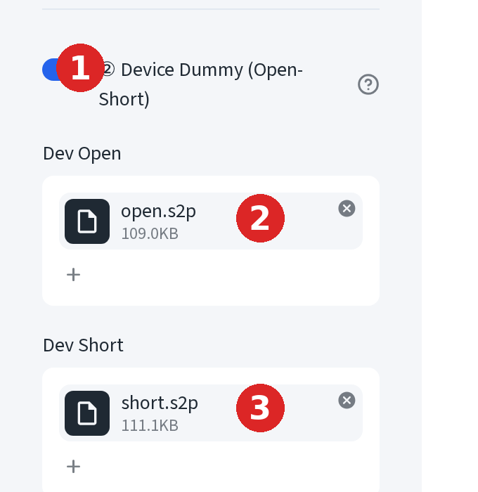
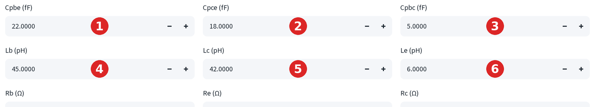
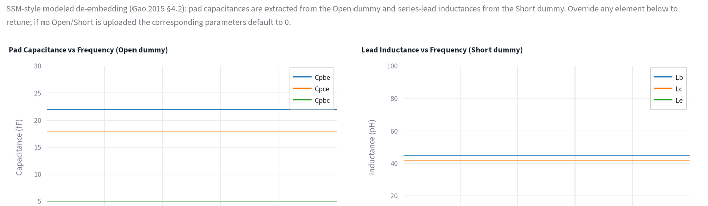
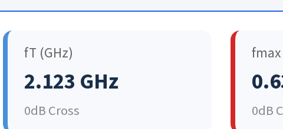
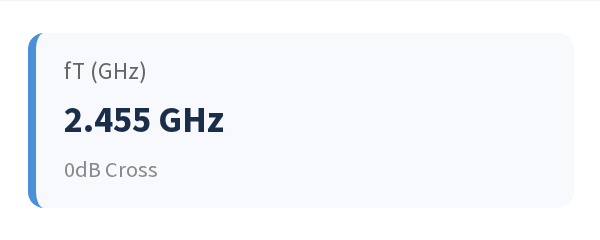
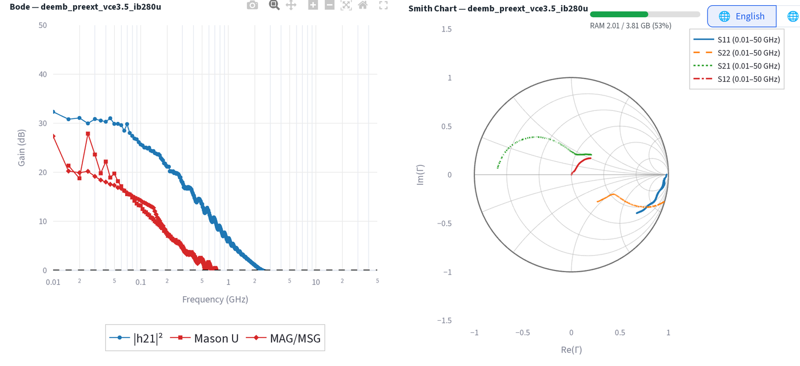

# Open/short de-embedding

Peel pad and lead parasitics with Open and Short standards, the same
extraction the Batch De-embed tab runs.

This page walks it end to end with the demo files: `open.s2p`, `short.s2p`,
and one DUT (`vce3.5_ib280u.s2p`).

## Step 1 — feed the Open and Short standards

1. In the sidebar, turn on **② Device Dummy (Open-Short)**.
2. Drop the Open file under **Dev Open**.
3. Drop the Short file under **Dev Short**.

These two files feed the Batch De-embed tab's calibration. Upload your DUT
file(s) through the main **Upload DUT .s2p / .csv files** box as usual, then
open the **Batch De-embed** tab.

## What each step removes

- **Open** removes the shunt pad capacitances: Cpbe (base, emitter), Cpce
  (collector, emitter), Cpbc (base, collector).
- **Short** removes the series lead inductances and resistances: Lb, Lc, Le
  (and Rpb/Rpc/Rpe), after the pad admittance is subtracted first.

The Batch De-embed tab shows both results as editable override fields,
seeded from the Open/Short calculation:

Edit any field to retune the de-embedding by hand;
click **↺ Reset to defaults** to go back to the computed values.

## Preview plots

Above the override fields, two plots let you sanity-check the calibration
before trusting it:

Both should be **flat lines** across frequency, the signature of a clean
parasitic extraction. A trace that slopes or curves means the standard is
not behaving like a pure capacitor/inductor over that band (parasitic
resonance or a bad probe touchdown), and the constant the override field
defaults to becomes less trustworthy.

## Before / after on the device

Peeling the parasitics off moves fT because the pad capacitance and lead
inductance were loading the intrinsic device. On the demo DUT:

**Before**, raw, no de-embedding (Individual tab, `De-embedding: None`):

**After**, de-embedded (Batch De-embed tab, per-file result):

fT rises from 2.123 GHz to 2.455 GHz once the pad/lead parasitics are
removed: the intrinsic device is faster than the probe-level measurement
suggested. The de-embedded Bode and Smith charts are on the same per-file
result:

## Modeled vs Measured source

Each of Open and Short can be de-embedded two ways, chosen independently:

- **Modeled**: builds the pad/lead network from the override values and
  subtracts it. This is what the numbers above use.
- **Measured**: subtracts the raw Open/Short S-parameters directly, with no
  model in between. Falls back to Modeled automatically if the dummy file
  is missing.
