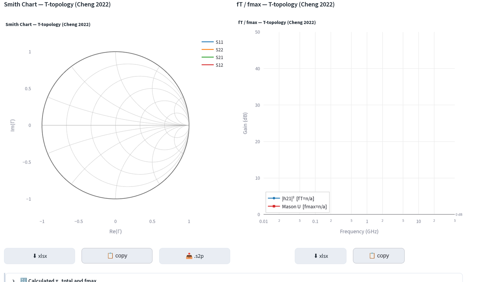
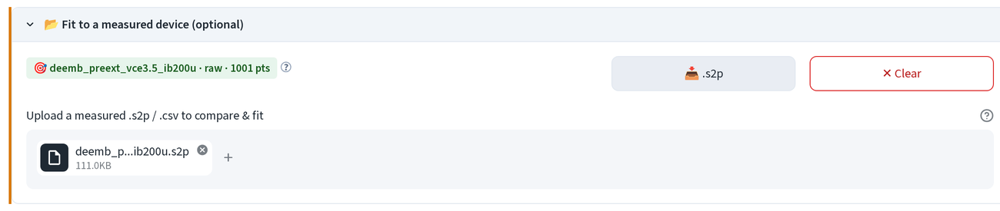
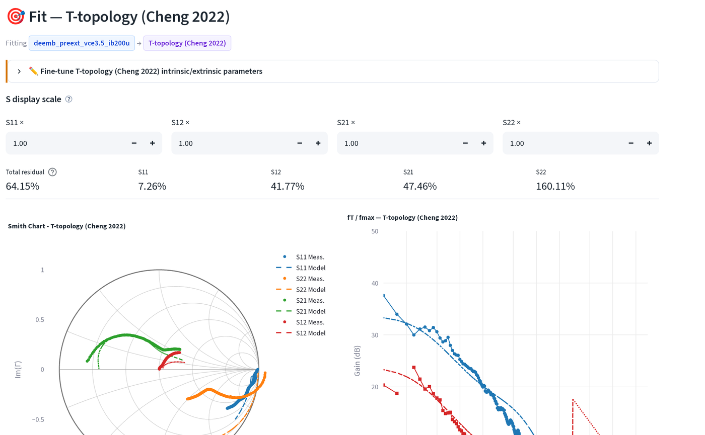
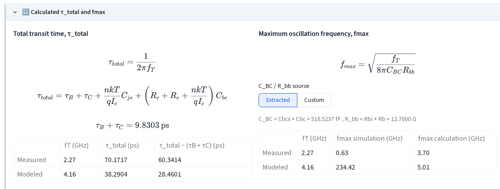

# Simulation & fitting

Forward-simulate any small-signal topology from scratch, or load a measured
`.s2p` and fit one to it. Open **SSM Simulation & Fitting** from the sidebar.

## 1. Pick a model

Click a chip in **Model**.

- **Cheng's T**: Cheng (2022) current-source T-topology HBT model, the
  default. Same topology the SSM Extraction page peels.
- **Cheng's π**: Cheng (2022) hybrid-π HBT model, same pad/access network as
  the T, different intrinsic core.
- **Xu T**: Xu (2014) T-topology HBT. No extrinsic Cbex; a parallel Rbcx
  sits across Cbcx (defaults to 285 kΩ, never extracted from a
  measurement, only hand-tuned).
- **Kun-Yang HEMT**: π-topology HEMT, forward-simulation only (no peeling
  extraction). Adds a source-side R_delay∥C_delay branch and a custom
  substrate pad network in place of the HBT's Cpbe/Cpce/Cpbc.
- **🧩 Custom model**: build and simulate your own netlist. Covered on its
  own page: [custom models](custom-model.md).
- **Open and Short Pad**: simulate the calibration dummies themselves
  (pad capacitances / lead inductances only), not a device. Useful for
  checking a de-embedding pair in isolation.

## 2. Forward simulation with no measurement loaded

With no file uploaded, every parameter starts at 0, the Smith chart is a
single point at Γ = 1 and fT/fmax read `n/a`. Fill in the **Inputs** panel
above (or switch its **Editor mode** to **Diagram** to set values on the
schematic) to see a real curve.

This is the same forward simulator whichever model chip is selected: type
values, read the Smith chart and the fT/fmax Bode plot back. `Start
Frequency`, `Data Points` and `Final Frequency` above the model inputs set
the sweep (hidden once a measured file is loaded, see below).

## 3. Fit to a measured device

Open **📂 Fit to a measured device (optional)** and drop a `.s2p` or
   `.csv` file.

The frequency axis now follows the uploaded file point-for-point, the
manual `Start/Final Frequency` inputs disappear.

Send a **de-embedded**
device (no Cpxx/Lx left in it) to fit the intrinsic device only; send a
**raw** device to fit the parasitics too.

`→ Simulation & Fitting` from RF
At a Glance's Individual tab hands a device over the same way, see
[handoff](#6-what-arrives-from-a-handoff) below.

The page switches to fit mode: a **Fine-tune** expander with one
   number input per model parameter, then the residual + charts.

**Total residual** is the RMS relative error between measured and modeled
S-parameters, with S11/S12/S21/S22 broken out per port, so a bad fit on one
port (here S22 at 160%, the weakest of the four) doesn't hide inside a
deceptively low total. Minimize it with
[visual or auto tuning](tuning.md).

## 4. fT/fmax, τ_total and fmax

The fT/fmax Bode panel sits next to the Smith chart in every mode (forward
or fit), solid markers for the swept simulation, dashed/dotted for
extrapolation past the measured band (see [RF at a glance](at-a-glance.md)
for how the extrapolation method is chosen).

Below the charts, **🔣 Calculated τ_total and fmax** expands the textbook
transit-time and fmax formulas with this fit's numbers plugged in:

`C_BC`/`R_bb` feeding the fmax formula come from the fitted Cbcx+Cbc and
Rbi+Rb by default, switch to **Custom** to type your own values instead.

## 5. The fit cache

Every edit inside **Fine-tune** — typed values, [tuning](tuning.md) commits
— auto-saves per (device, model) on disk. Reopening the same device against
the same model picks it back up automatically and shows it in the header:

The cache applies **unless** a fresh handoff just arrived from Extraction: a
new handoff always wins over an older cached fit for the same device.

## 6. What arrives from a handoff

Clicking **→ Simulation & Fitting** on RF At a Glance's Individual tab (or
sending a model from SSM Extraction) lands here with:

- the device's S-parameters already loaded, as if uploaded by hand;
- the matching model chip pre-selected;
- when the sender had extracted values (Extraction, not a raw at-a-glance
  device), every Fine-tune field seeded from that extraction instead of the
  auto-guessed defaults an upload gets.

A fresh handoff also clears any leftover seed from a *previous* handoff, so
switching devices never leaves stale values behind.

Next: [building a custom topology](custom-model.md) · [tuning](tuning.md) ·
[chart controls](charts.md).
