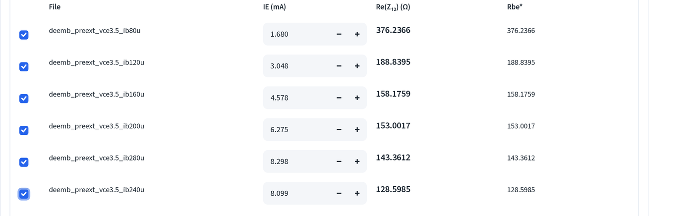
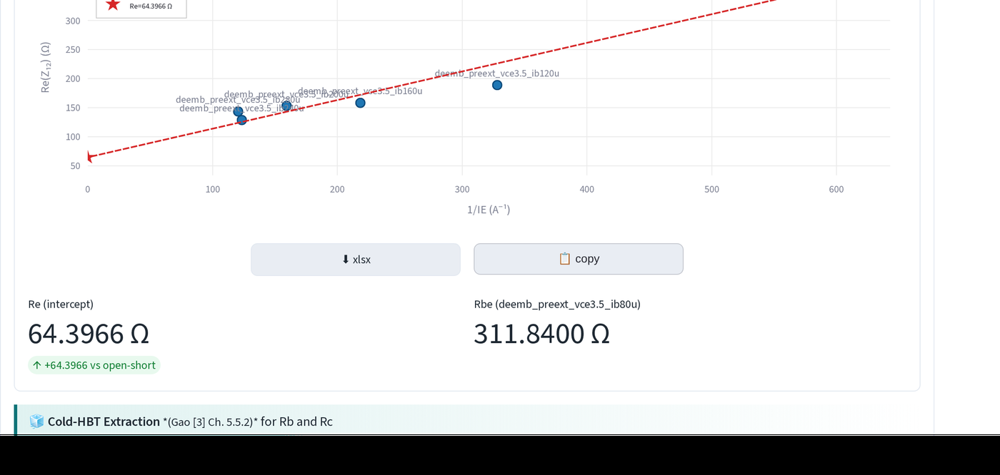
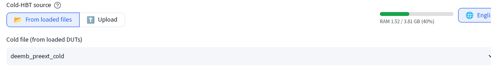
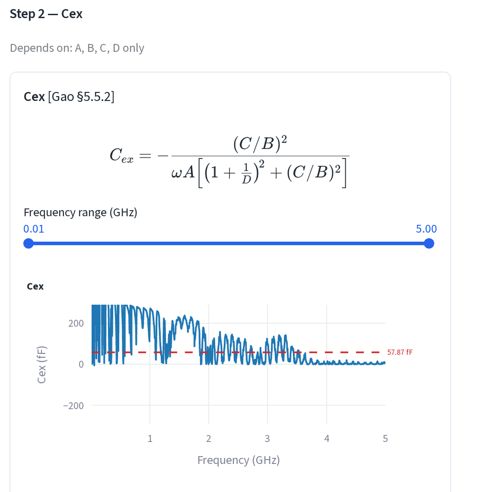
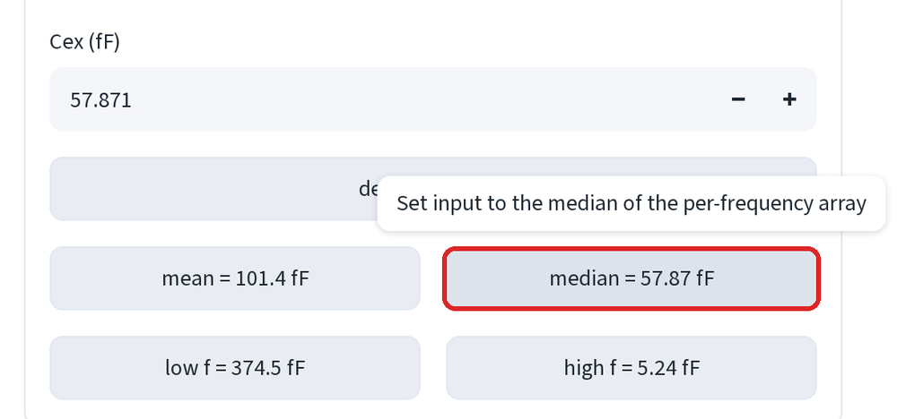
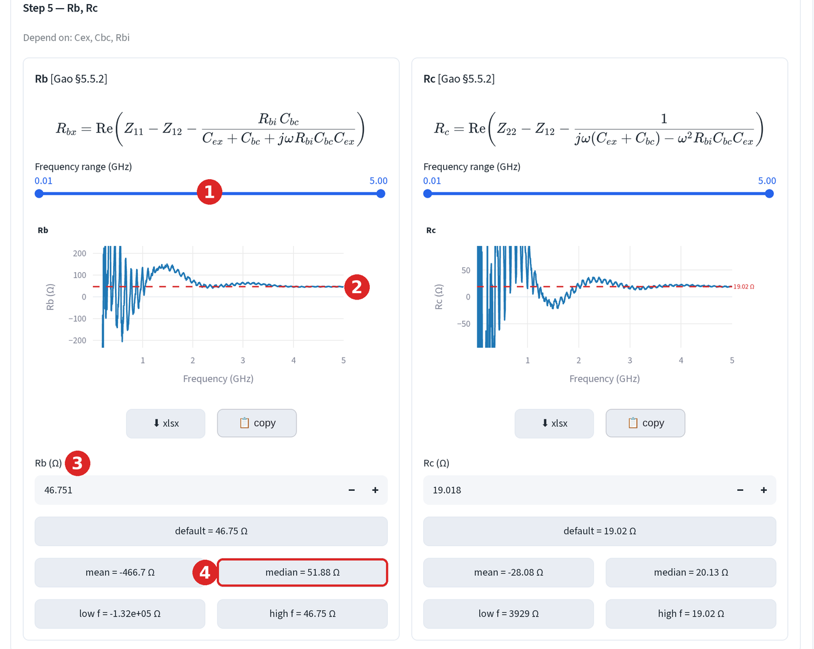

# 模型萃取：接觸電阻

在本質擬合之前先取得 Re、Rb 與 Rc。後續每一步都依賴這三個數字，值得花幾
分鐘處理好。

在萃取頁開啟**🍊 存取電阻萃取 (🍊 Access Resistance Extraction)**。

!!! warning "順序很重要"
    先執行 **Z-parameter 方法求 Re**，再執行 Cold-HBT 求 Rb 與 Rc。Gao
    §5.5.2 在計算 A、B、C、D 之前，會先從 Z_cor 中移除 Re，因此冷態萃取
    把 Re 當作*輸入值*。若先開啟 Cold-HBT，其 **Re (Ω)** 欄位會顯示
    `0.0000`，在你毫無察覺的情況下，用完全沒有射極電阻擬合出 Rb 與 Rc。
    以此元件為例，這正是 Rb = 29.29 Ω 與 Rb = 46.75 Ω 的差別所在。

## 步驟 1：Z-parameter 方法求 Re

Re 取自 Re(Z₁₂) 對 1/I_E 在整個偏壓掃描上的截距。開始前先載入多個偏壓
點，單一個點無法擬合出一條線。

1. 表格列出每個已載入的檔案。勾選要納入的檔案，並輸入各自的射極電流。
   使用 **I_E = I_C + I_B**，而非 I_C。

    

    以示範元件為例：

    | 檔案 | I_C | I_B | I_E = I_C + I_B |
    |---|---|---|---|
    | `ib80u` | 1.600 mA | 80 µA | **1.680 mA** |
    | `ib120u` | 2.928 mA | 120 µA | **3.048 mA** |
    | `ib160u` | 4.418 mA | 160 µA | **4.578 mA** |
    | `ib200u` | 6.075 mA | 200 µA | **6.275 mA** |
    | `ib240u` | 7.859 mA | 240 µA | **8.099 mA** |
    | `ib280u` | 8.018 mA | 280 µA | **8.298 mA** |

    冷態點（I_C = 77.68 µA，I_B = 0）不屬於此擬合；它會提供下方步驟 2 的
    Cold-HBT 萃取使用。

2. 從截距讀出 **Re**。

    

    **Re = 64.3966 Ω**，最低電流檔案報出的 Rbe = 311.84 Ω。將這個數字帶
    入步驟 2。

!!! tip
    兩個電流最高的點幾乎重疊在一起（8.099 與 8.298 mA），因此兩者合起來
    對擬合的約束力並不比單一個點更強。若截距看起來不穩定，將偏壓掃描
    拉開一些。

## 步驟 2：Cold-HBT 求 Rb 與 Rc

「冷態」量測是指元件未施加偏壓時的量測。兩個接面都關閉時，Z₁₁ 與 Z₂₂
簡化為接觸網路加上接面電容，一旦知道 Re，Rb 與 Rc 便可解出。

1. 將 **Cold-HBT 來源 (Cold-HBT source)** 設為**📂 從已載入檔案 (📂 From
   loaded files)**，並從下拉選單選擇 `deemb_preext_cold`。若該檔案不在
   已載入的 DUT 中，可在此直接上傳。

    

2. 檢查 Cold-HBT 下方的 **Re (Ω)** 欄位。它應該已經帶有步驟 1 得到的
   64.3966 Ω。若顯示 `0.0000`，代表 Z-parameter 擬合尚未執行：回頭先
   完成它。

3. 開啟**📊 互動式參數萃取 (📊 Interactive Parameter Extraction)**。步驟
   2 萃取 **Cex**；Rb 與 Rc 都相依於它，Cbc 與 Rbi 亦然。

    

4. **點選 `median` 晶片改用中位數**，57.87 fF。

    

    預設值（188.7 fF）是低頻值，平均值（101.4 fF）同樣受到雜訊影響而
    搖擺不定。逐頻率的陣列一旦越過低頻端就趨於平坦，因此中位數才是可信
    的數字。下面的每一步都會沿用這個值。

5. 步驟 5 現在給出 **Rb = 46.751 Ω** 與 **Rc = 19.018 Ω**。

    

    1. **頻率範圍**：將其收窄至曲線平坦的頻段。
    2. 紅色虛線是目前使用中的數值。
    3. 數值框，直接輸入即可覆寫。
    4. 下方的晶片可由統計值填入數值框，點選即可套用。

    兩條曲線在約 2 GHz 以上都會收斂到各自的虛線，且兩者的中位數
    （51.88 Ω 與 20.13 Ω）都接近預設值。這種一致性正是萃取結果健全的
    訊號。當平均值與中位數差異懸殊時，把頻率範圍拖到平坦的區段，再由
    該處取值。

## 應該得到的結果

| | 數值 |
|---|---|
| Rb (=Rpb) | 46.7508 Ω |
| Rc (=Rpc) | 19.0178 Ω |
| Re (=Rpe) | 64.3966 Ω |
| Rbi（冷態） | 158637.0901 Ω |
| Cbe（冷態） | 119.9716 fF |
| Cbc（冷態） | 1458.7848 fF |
| Cex | 57.8714 fF |

## Open-collector

第三種方法在集極開路的狀態下驅動基極-射極接面。當你有這項量測、又沒有
可用的冷態掃描時使用它；它是 Cold-HBT 步驟的替代方案，而非額外附加項目。

---

下一步：[本質模型](ssm-intrinsic.md)。
