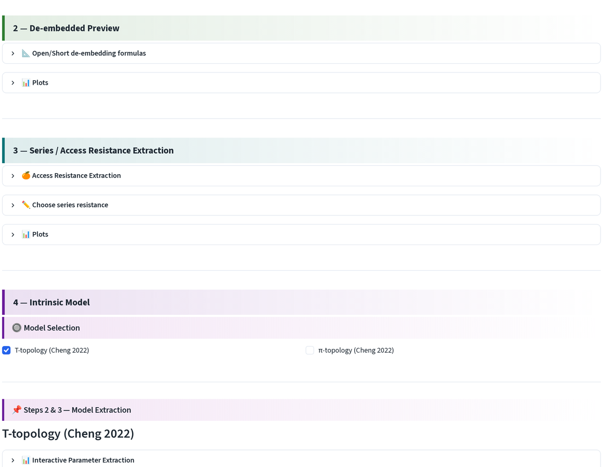
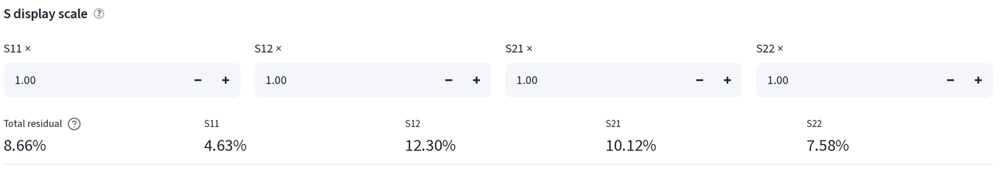
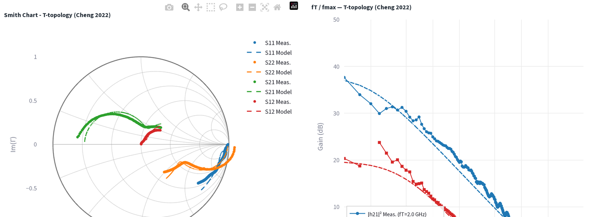
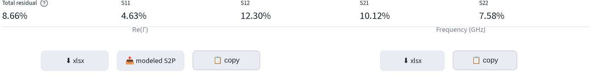
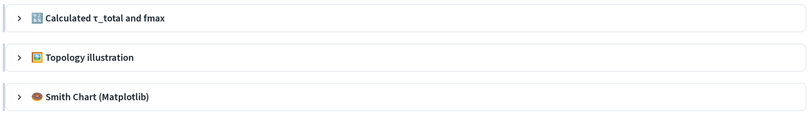
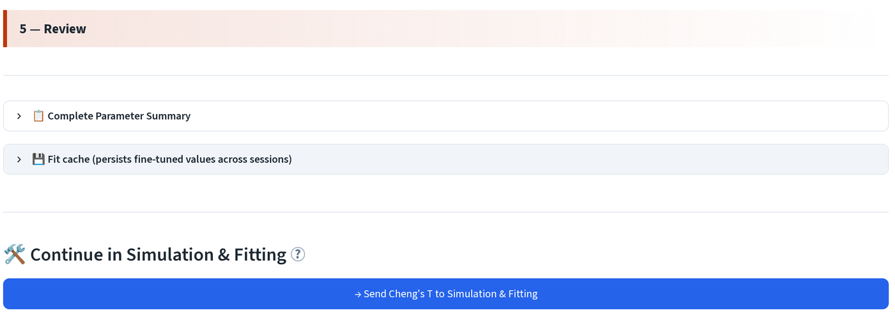

# 模型萃取：微調與檢查

萃取流程會給出一個模型。這一頁要決定的是：這個模型能不能用。

## 目前在頁面的哪個位置

萃取頁由上到下共分五個編號區段。以下內容都在**4：本質模型 (4 -
Intrinsic Model)** 與**5：檢視 (5 - Review)** 之中。

## 手動微調

在**量測與模型 S 參數比較 (Measured vs Modeled S-Parameters)** 下，開啟
**✏️ Fine-tune T-topology (Cheng 2022) intrinsic/extrinsic parameters**。

直接輸入任一數值，模型曲線會立即重繪。此處的焊墊參數為灰階不可編輯狀態，
它們會自動與萃取前的覆寫值同步，若要更動請回到[設定](ssm-setup.md)頁，
而不是在這裡與它們拉扯。

渡越時間就是在這裡修正。Cheng 的解析萃取對此元件給出 τB = 10.7654 ps、
τC = −6.7695 ps；請改用[渡越時間擬合](ssm-transit-time.md)得到的
τB = 19.0480 ps 與 τC = 0.1500 ps 覆寫它們，該擬合是跨六個偏壓點量測
而來，而非由單一萃取拆分。

微調後的值會儲存到擬合快取，下次以同一模型開啟同一個元件時會自動帶回。

## 殘差與顯示比例

**S display scale** 會在繪圖前對每條曲線乘上倍率，用來把 S12 拉到與
S21 相近、方便閱讀的大小。這只影響顯示，**不會**改變殘差。

**Total residual** 是整個頻段上的擬合誤差，並附上各 S 參數的細項。以此
元件為例：總計 8.66%，其中 S11 4.63%、S12 12.30%、S21 10.12%、
S22 7.58%。

經驗法則：

- 總殘差在約 5% 以下算是良好的解析萃取。
- S12 幾乎總是四者中最差的一個；它是訊號最小、也最容易受殘留焊墊電容
  影響的一項。
- 若只有一個參數遠高於其他項，代表問題出在特定元件而非整體模型。
  S22 偏高指向集極側（Rc、Cbc）；S11 偏高指向基極側。

## Smith 圖與 Bode 圖

量測曲線以實線加標記顯示，模型曲線則為虛線。兩者要一起看：Smith 圖顯示
模型在頻段中哪裡偏離量測，增益圖則顯示這個偏差對 f_T 與 f_max 造成多少
影響。

第 5 節中的 **📊 Smith Chart (Matplotlib)** 會以出版品質的圖表呈現相同
資料，不含 Plotly 工具列。

## 匯出

- **xlsx**：以試算表格式匯出繪製資料。
- **modeled S2P**：以 Touchstone 檔案格式匯出擬合模型，可直接用於模擬器。
- **copy**：點選即可將資料複製到剪貼簿，直接貼到 Origin。

## τ_total 與 fmax

**🔢 Calculated τ_total and fmax** 會報告由擬合模型計算出的兩項效能指標，
而非直接從曲線讀值：

- **τ_total** = 1/(2πf_T)，即射極到集極的總延遲。將它與[渡越時間擬合](ssm-transit-time.md)的截距比較，若兩者差距很大，代表其中一個
  受到某個不良元件影響。
- **f_max**：由擬合模型計算得出。增益圖上的外插值是其量測對應值，兩者
  應在數個百分點以內相符。

## 將模型傳送出去

1. **📋 完整參數彙總 (📋 Complete Parameter Summary)** 將每個萃取與微調後
   的值列於同一張表，可在此直接複製。
2. **💾 擬合快取（跨工作階段保存微調數值） (💾 Fit cache)** 顯示此元件與
   此模型目前已持久化儲存的內容。
3. **→ 將 Cheng's T 送至模擬與擬合 (→ Send Cheng's T to Simulation &
   Fitting)** 會把元件、拓樸與目前每個參數值一併傳送過去，讓你可以繼續
   調整，不必重新上傳任何東西。

---

下一步：[模擬與擬合](sim-fit.md)。
