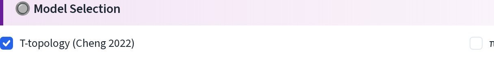
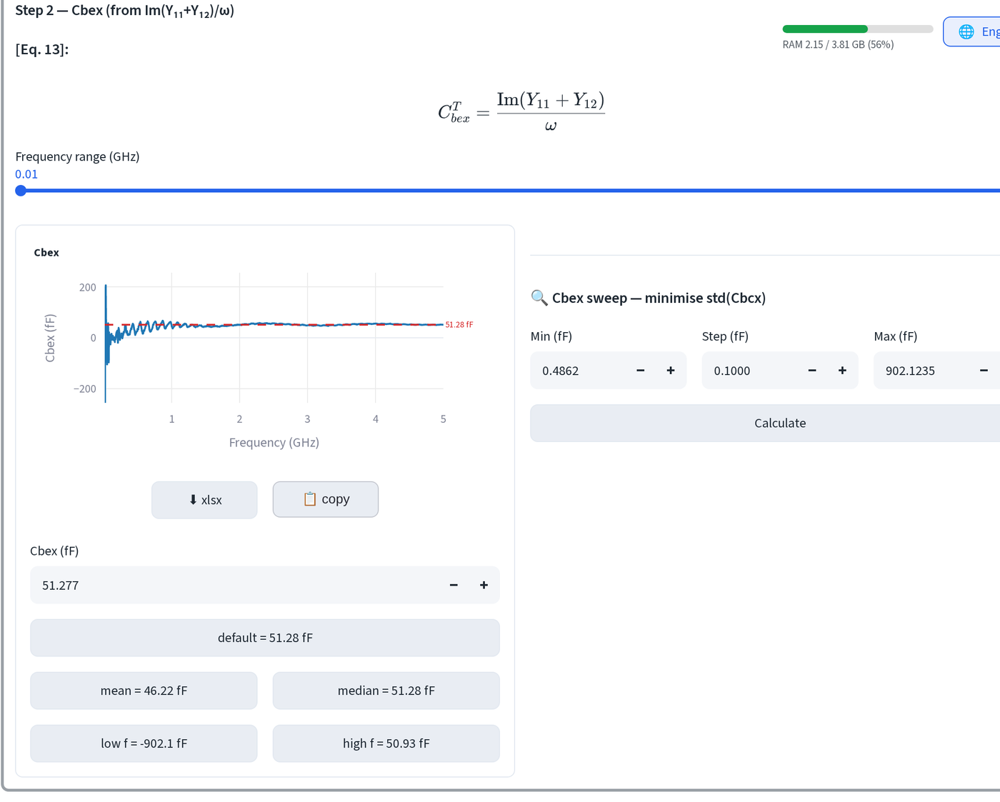
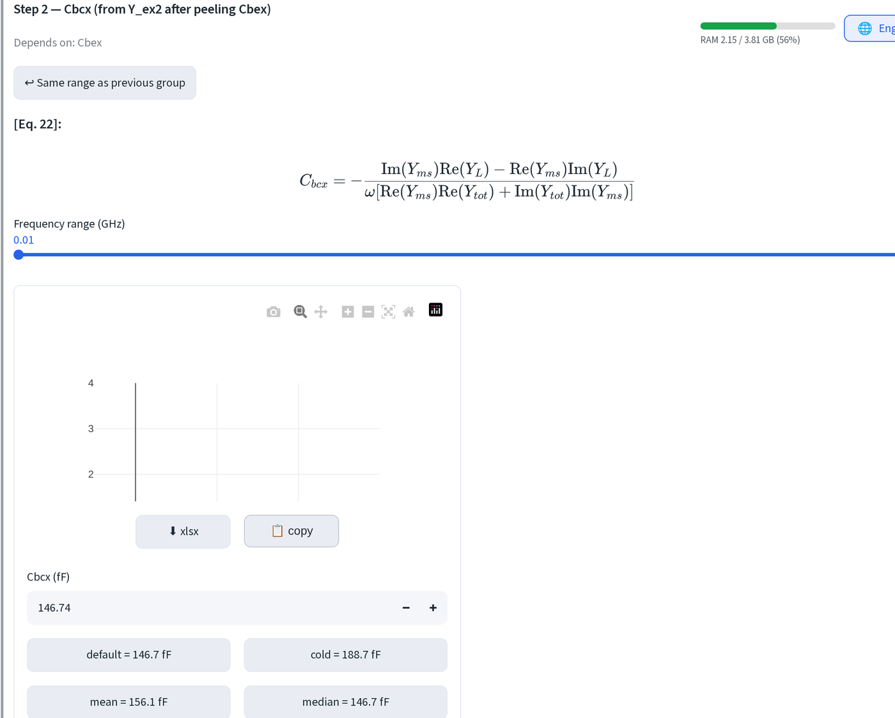
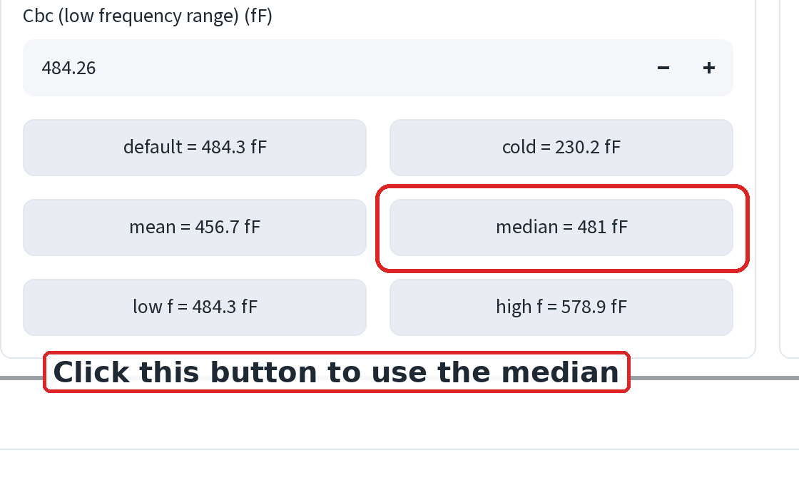

# 模型萃取：本質模型

在焊墊、引線與接觸電阻都確定之後，剩下的元件會逐一剝離。每個步驟都有各自
的方程式、圖表，以及可覆寫的數值。

## 選擇拓樸

開啟**🔘 模型選擇 (🔘 Model Selection)**，勾選 **T-topology (Cheng
2022)**。

π 拓樸是相同的萃取流程，只是對應不同的等效電路。選定一種後就不要更換；
在兩者之間混用萃取值毫無意義。

## 逐步操作

開啟**📊 互動式參數萃取 (📊 Interactive Parameter Extraction)**。每個步驟
的模式都相同：

1. 該步驟所計算的方程式，讓你看清它依賴哪些量。
2. **頻率範圍 (Frequency range)**：拖到曲線平坦的區段。
3. 圖表，目前使用中的值以紅色虛線標出。良好的萃取應在約十倍頻程內保持
   平坦；若曲線始終不收斂，代表上游某個值有誤。
4. 數值框，以及可由統計值填入的晶片。

依賴前面步驟數值的步驟，會在標題下方註明（例如「Depend on: Cex, Cbc,
Rbi」），因此當後面某個步驟看起來不對時，應回去檢查它所依賴的值，而不是
與眼前的數字硬碰硬。

部分步驟會在右側加入掃描工具：**Cbex sweep：minimise std(Cbcx)** 會在
Min/Step/Max 範圍內搜尋能讓 Cbcx 最平坦的 Cbex。設定範圍、點選
**Calculate**，即可自動填入數值框。

## Cbc：使用中位數

Cbc 預設為低頻值。**點選 `median` 晶片改用中位數。**

低頻估計值取自量測雜訊最大的區段。中位數會忽略頻段兩端的振鈴現象，在整個
偏壓掃描中是較為穩定可重複的選擇。在此設定好之後再繼續；後面每個依賴 Cbc
的步驟都會沿用數值框中的內容。

## 應該得到的結果

在使用[接觸電阻步驟](ssm-access-r.md)得到的 Re、Rb、Rc，並將 Cbc 設為
中位數之後，T 模型給出：

- Cbex、Cbcx
- Rbi、Rbe、Cbe
- Rbc、Cbc
- alpha0
- tauB、tauC

若 τC 是負值，真實的集極不會如此：這是單一解析萃取的假象，也是為什麼
[渡越時間擬合](ssm-transit-time.md)才是 τB 與 τC 更好的來源。出貨模型前，
請用該處的值取代這兩個參數。

!!! tip
    `cold = …` 晶片會改用冷態量測值填入數值框。那是零偏壓下的接面電容，
    而非有偏壓時的值，因此應將其視為健全性檢查，而非可直接採用的數值。

---

下一步：[渡越時間](ssm-transit-time.md)。
