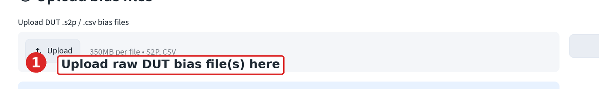
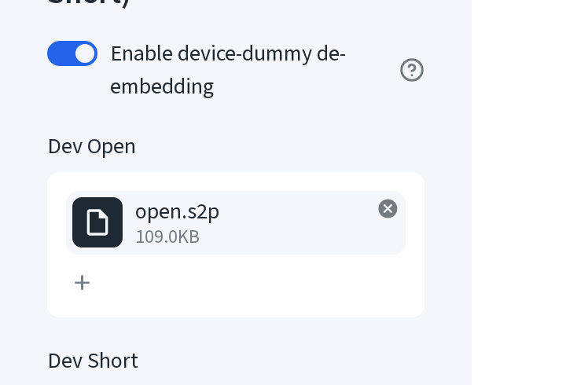
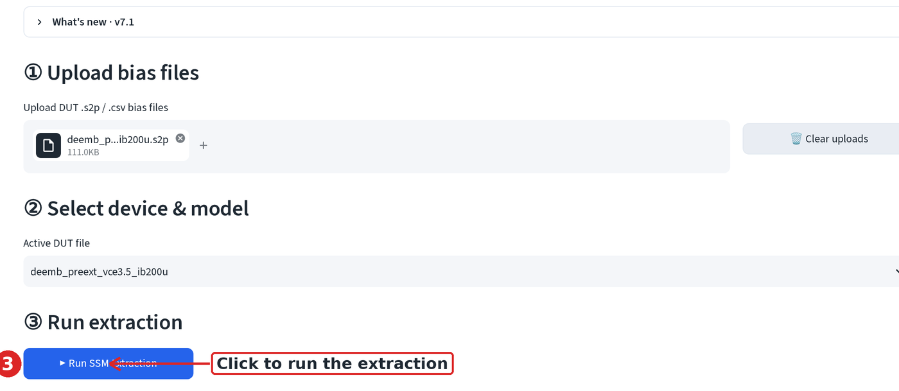
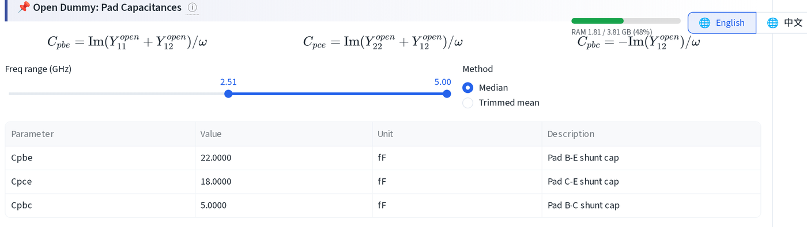
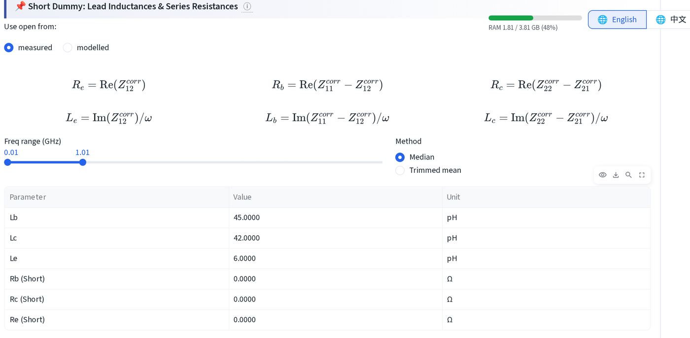
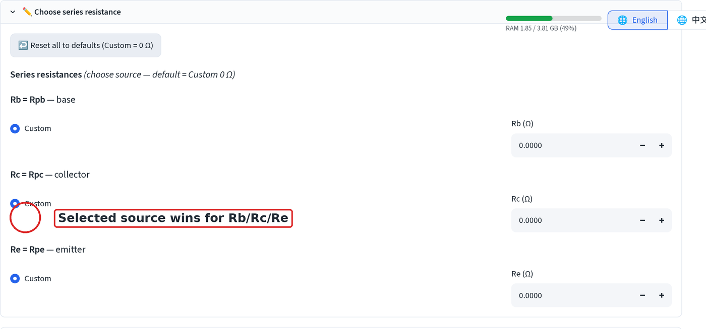

# Model extraction: setup

Load a device and choose a small-signal model topology. This page walks
through the SSM Extraction page from an empty upload to a de-embedded device,
using the raw (non-de-embedded) demo files.

## 1. Upload the raw device file

Open **Small Signal Model Extraction by Peeling** from the sidebar.

1. Upload one or more raw bias `.s2p` files under **① Upload bias files**.
   Use `raw/vce3.5_ib200u.s2p` from the demo set. This file
   still has the pads and leads on.

Multiple bias files can go in at once, later steps (Z-parameter access
resistance, τ_total fit) need more than one to fit a line.

## 2. Upload Open and Short

The Open and Short dummies live in the sidebar, not the main upload area.

2. Toggle **Enable device-dummy de-embedding** in the sidebar.

Two file slots appear: **Dev Open** and **Dev Short**. Drop `open.s2p` into
the first and `short.s2p` into the second.

A green **Pad de-embedding active** line confirms both files parsed.

## 3. Run the extraction

3. Pick the active file under **② Select device & model** (only matters once
   more than one DUT file is loaded), then click **▶ Run SSM Extraction**.

## 4. Check the pad capacitances

Extraction opens on **1 — Pad Capacitance & Series Inductance**, inside the
**📌 Open & Short Dummy De-embedding** expander. The Open dummy gives the
three pad shunt capacitances:

The table should give Cpbe, Cpce, Cpbc. If required, move the frequency  slider where it finds the median of the top 50% of the sweep, where the Open dummy is cleanest.

## 5. Check the lead inductances

Scroll down inside the same expander to the Short dummy block:

Expect Lb, Lc, Le.

## 6. Choose what feeds the extraction

Scroll to **3 — Series / Access Resistance Extraction** and open **✏️ Choose
series resistance**. This panel decides which value of Rb, Rc, and Re
actually reaches the model, not the Short dummy above.

Each of Rb, Rc, Re has its own source radio. Right after Step 1, the only
option is **Custom**, defaulted to 0 Ω, type a value directly into the
Rb/Rc/Re boxes on the right if you already know it. Once you run the
Cold-HBT, Z-parameter, or open-collector methods (next page), those show up
as extra radio choices here, each labelled with its extracted value, and
whichever one is selected is the value that feeds every model downstream.
**Short (Step 1b) is deliberately not offered**, the app treats the Short
method as the least reliable of the four for access resistance, so it never
wins by default.

Pad capacitances (Cpbe/Cpce/Cpbc) and lead inductances (Lb/Lc/Le) are not
editable in this panel; they always follow Step 1's Open/Short extraction
(or its "Override Open Capacitances" / "Override Short Lead Values"
expanders, if you nudged them there).

Next: [access resistance](ssm-access-r.md).
