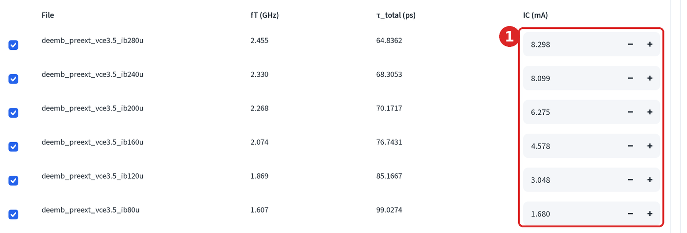
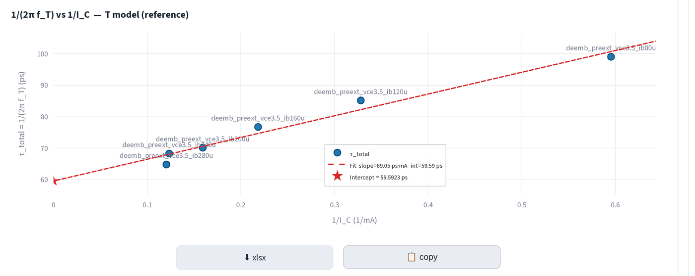
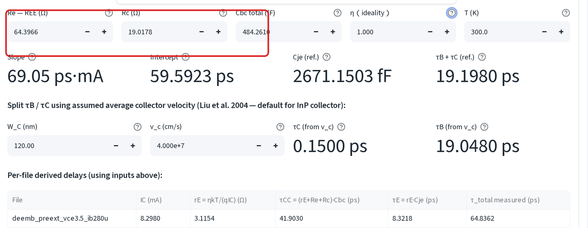
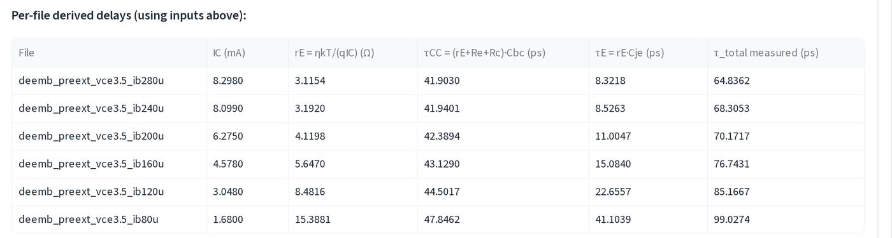

# 模型萃取：渡越時間

τ_total 對 1/I 作圖，截距給出 τ_B + τ_C，斜率給出 C_JE。這需要多個偏壓
點，因此開始前請先載入整組掃描資料。

開啟 **📊 Interactive Parameter Extraction**，然後選擇
**Cje / τB+τC / τCC / τE from 1/(2πf_T) vs 1/I_C fit**。

擬合圖將 τ_total 對 1/I_C 作圖：截距為 τ_B + τ_C，斜率則帶有 C_JE。

## 使用 I_E = I_C + I_B

在列中輸入集電極電流 I_C (mA)。

## 判讀擬合結果

- **截距**：量測延遲中不隨電流縮小的部分。
- **斜率**：由此可求出 C_JE。

這個截距還不是 τ_B + τ_C。集極充電項 (R_C + R_EE + r_E)·C_BC 仍須扣除，
這正是下方輸入欄的用途。

## 代入實際的接觸電阻

**輸入值（預設取自此檔案的萃取結果） (Inputs (defaults from this file's
extraction))** 一開始為 Re — REE = `0.0000`，Rc = `0.0000`。除非
[接觸電阻步驟](ssm-access-r.md)已經執行過，否則這些預設值都是錯的。請
輸入方框標出的三個數值：

- **Re — REE (Ω)**：來自 Z-parameter 擬合
- **Rc (Ω)**：來自 Cold-HBT
- **Cbc total (fF)**：來自 T 模型萃取

除非你有 Gummel 擬合另有指示，否則將 η 保留在 1.000，T 保留在 300.0。

代入之後答案會有很大的變化：截距中剩下的部分全部都是集極充電。

### 拆分 τ_B 與 τ_C

**Split τ_B / τ_C** 這一列會用假設的平均集極速度拆分總和。以 InP 預設值
W_C = 120 nm 與 v_c = 4.000e+7 cm/s 計算，這一列會給你 τ_C 與 τ_B。

**用這兩個值取代 Cheng 的 τB 與 τC。**[本質模型頁](ssm-intrinsic.md)上的
解析萃取可能給出負的 τC，而負的集極渡越時間並不物理。渡越時間擬合使用
整組偏壓掃描與量測到的 f_T，因此是可信的數字。

下方逐檔案表格顯示，代入修正後的輸入值後，每個檔案落在哪個位置：

這些萃取值僅供參考讀值。它們**不會**自動回饋到模型擬合中，若要讓它們
進入最終出貨的模型，需手動輸入到微調面板。

## 該用哪一種電流

本頁依循 Cheng 的預設使用 I_C，但請改用 I_E。所擬合的延遲是射極到集極的
總渡越時間，而在 InP HBT 掃描的低電流端，I_B 佔 I_C 的百分之幾——足以
彎曲決定截距的那些點。

不論選哪一種，每一列都要一致使用。若部分列用 I_C、部分列用 I_E，等於是
對兩種不同的量擬合同一條線。

## 跨檔案的 τ_total

多檔案區段會針對每個勾選的檔案，一次擬合出一組共用的 τ_total 參考值，
上表中的數字即由此而來。勾選不同子集合，可以看出單一偏壓點對擬合結果的
影響有多大。若拿掉一個點就讓截距大幅移動，代表掃描範圍太短。

---

下一步：[微調與檢查](ssm-finetune.md)。
