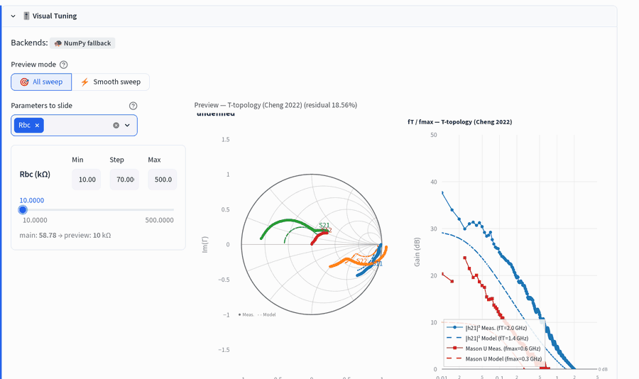
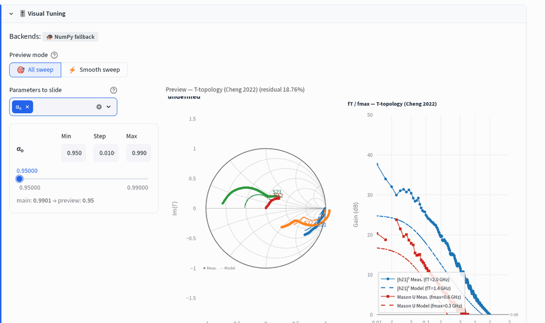
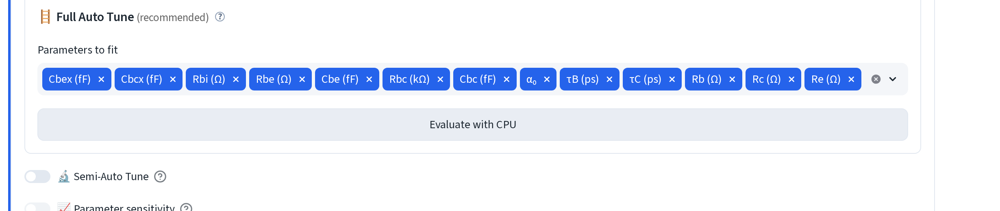
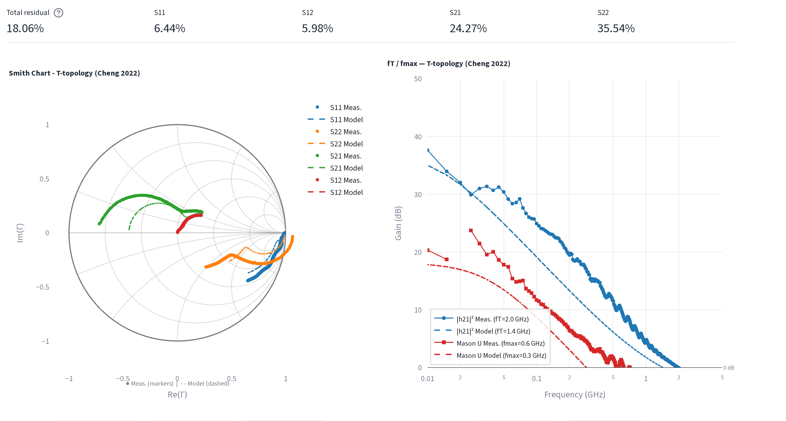
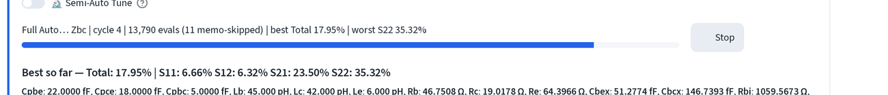
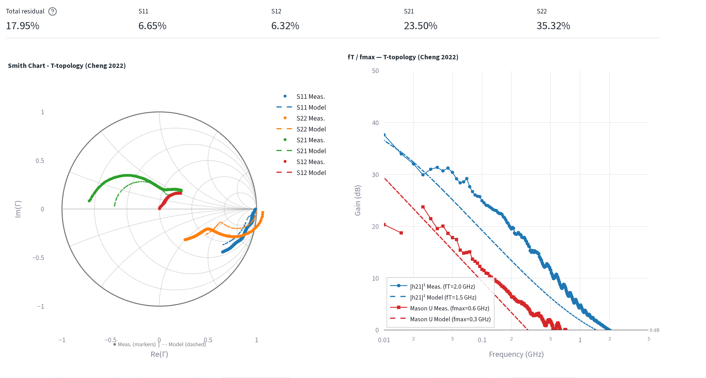
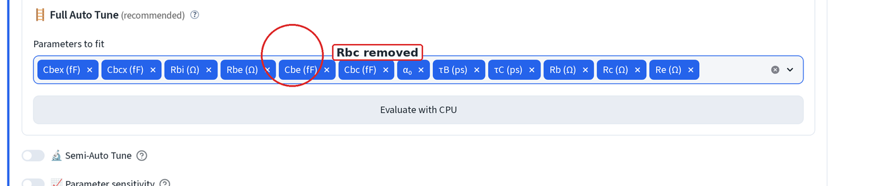

# Visual & auto tuning

Both live inside the **Fine-tune** expander that appears once you're in
[fit mode](sim-fit.md#3-fit-to-a-measured-device), a measured device
loaded and a model chip selected. Adjust parameters by hand with a slider,
or let a tuner search for you.

Everything below starts from the model the extraction walkthrough produces,
loaded against the raw (not de-embedded) measurement so the pad and lead
parasitics have something to work against:

| | | | |
|---|---|---|---|
| Rb | 46.7508 Ω | Cbex | 51.2774 fF |
| Rc | 19.0178 Ω | Cbcx | 146.7393 fF |
| Re | 64.3966 Ω | Rbi | 1103.1865 Ω |
| Cpbe / Cpce / Cpbc | 22 / 18 / 5 fF | Rbe | 138.8055 Ω |
| Lb / Lc / Le | 45 / 42 / 6 pH | Cbe | 121.1760 fF |
| α₀ | 0.9901 | Rbc | 58.7816 kΩ |
| τB | 19.0480 ps | Cbc | 484.2610 fF |
| τC | 0.1500 ps | | |

τB and τC are the transit-time-fit values, not Cheng's analytic split, as
[the fine-tune page](ssm-finetune.md) explains. That model sits at an
**18.06% total residual** before either tuner runs. If your starting residual
is in the hundreds of percent, the model has not been loaded: check the
`📌 cache from …` chip next to the device name, or hand the device over from
[Extraction](ssm-finetune.md#hand-the-model-on) again.

## 1. Visual Tuning, slider-driven preview

1. Open **🎯 Visual Tuning**, then pick one or more parameters under
   **Parameters to slide**. Each gets its own Min/Step/Max row and a slider.
2. Drag the slider. The preview Smith chart, the residual in the preview
   title, and the fT/fmax panel all update as you move it, nothing else on
   the page changes until you commit the value.

Rbc swept from **10 kΩ to 500 kΩ** in 70 kΩ steps. The
`main: 58.78 → preview: … kΩ` line under the slider shows the value currently
live in **Fine-tune** against the one you're previewing, nothing is written
back until you accept it. Watch S12 (red) and S22 (orange): at the bottom of
the range the base-collector shunt pulls both away from the measurement and
the residual rises from 17.98% to 18.56%.

α₀ swept from **0.95 to 0.99** in 0.01 steps. Its Min/Step/Max is clamped to
that range app-side no matter what you type, so it can't be pushed past 1.
α₀ moves S21 and the |h21|² roll-off together, which is why the extraction
lands on 0.9901 rather than on anything rounder.

Two modes sit above the parameter picker:

- **🎯 All sweep**: every drag reruns the app and simulates a fresh point.
  Exact, but only as smooth as the network round-trip.
- **⚡ Smooth sweep**: precomputes every step across the box up front, then
  scrubs the cached curves client-side. Use it for a parameter you want to
  drag back and forth repeatedly.

## 2. Auto Tuning, one click

1. Open **Auto Tuning for Minimum Residuals** → **🪜 Full Auto Tune
   (recommended)**. **Parameters to fit** defaults to every canonical
   parameter, Cpbe/Cpce/Cpbc and Lb/Lc/Le (the parasitic pad/lead group)
   start **unselected**, because those come from open/short de-embedding,
   not from fitting the intrinsic device.

2. Click **Evaluate with CPU**. The sticky residual row and the Smith/fT-fmax
   charts above show where you started:

The search is coarse-to-fine and does not block the page, the button turns
into **⏹ Stop** and a live **Best so far** line updates every cycle until you
stop it or it hits its step floor:

The **Best so far** line prints every parameter, so you can see what actually
moved. In the capture above only Rbi and Rbc were in scope, and four cycles
took the total from 18.06% to 17.95%: Rbi 1103.19 → 1059.57 Ω,
Rbc 58.78 → 2536.09 kΩ. Starting from a sound analytic extraction, auto tuning
polishes rather than rescues. A parameter that runs off to an absurd value
(2.5 MΩ here) is telling you the fit is insensitive to it, not that the device
really is like that.

3. Press **⏹ Stop** whenever the residual is good enough, then **🏆 Use best
   values** to write the best row back into **Fine-tune**. The residual row
   and the main charts redraw against the committed values:

Semi-Auto Tune (brute-force / optimized / prioritized grid sweeps) and the
CUDA path sit below Full Auto Tune for when you want to control the search
box or metric by hand instead of the one-click default, not covered here.

### Pin a parameter instead of fitting it

Rbc is in scope by default, and the run above shows why that is not always
useful: four cycles ran it out to 2536.09 kΩ for a 0.11 percentage-point
gain. That is the fit telling you it cannot see Rbc, not a measurement of the
device. Take it out of the search and hold it at its extracted value
instead:

1. Open **Parameters to fit**. Each selected parameter is its own BaseWeb
   tag with its own delete icon. Click the **×** on the **Rbc (kΩ)** tag to
   remove it. Backspace does not reliably remove a whole tag, it edits the
   last tag's label one character at a time.

2. Rbc drops out of the search box. It keeps whatever value is currently in
   **Fine-tune** (58.7816 kΩ here) and is simply not searched.

Running the tuner again with Rbc pinned and only Rbi left in scope converges
to Total 18.04% (S11 6.65%, S12 6.30%, S21 23.82%, S22 35.38%), barely below
the 18.06% starting point, against the 17.95% an unpinned Rbc bought by
running off to 2536 kΩ. Pinning it costs almost nothing on the residual and
keeps the model physical.

Next: [chart controls](charts.md) · back to
[simulation & fitting](sim-fit.md).
